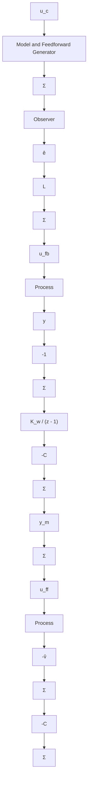

Figure 4.15 Another representation of the general controller structure with feedback from estimated states, disturbance states, and model following. Compare with Fig. 4.14

After straightforward algebraic manipulations we obtain

$$u (k) = u _ {f b} (k) + u _ {f f} (k)u _ {f f} (k) = \lambda \left(C _ {f f} x _ {m} (k) + u _ {c} (k)\right)u _ {f b} (k) = L \hat {e} (k) - \hat {v} (k)\hat {e} (k + 1) = (\Phi - \Gamma L - K C) \hat {e} (k) + K \left(y _ {m} (k) - y (k)\right) \tag {4.64}\hat {v} (k + 1) = \hat {v} (k) - K _ {w} \left(y _ {m} (k) - y (k) - C \hat {e} (k)\right)x _ {m} (k + 1) = \Phi_ {m} x _ {m} (k) + \Gamma_ {m} u _ {c} (k)$$

The transfer function from $y - y_{m}$ to $\hat{e}$ is given by Eq. (4.45). A block diagram of the controller is shown in Fig. 4.15. We will illustrate the ideas by controlling the double integrator.
