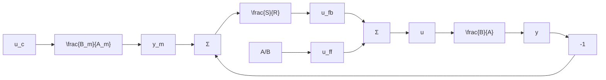

# Separation of Disturbance and Command Signal Response

In Sec. 4.6 we designed a controller where the response to command signals was completely separated from the response to disturbances. This is a nice property because it gives the designer much freedom. It is straightforward to obtain a similar controller using the polynomial approach. Let the factored model be described by $A = A^{+}A^{-}$ and $B = B^{+}B^{-}$ , where $A^{+}$ and $B^{+}$ are the dynamics that will be canceled. Furthermore let the desired response to command signals be given by

$$y _ {m} = H _ {m} u _ {c} = \frac {B _ {m}}{A _ {m}} u _ {c} \tag {5.25}$$

To obtain perfect model following the polynomial $B^{-}$ must be a factor of $B_{m}$ , because $B^{-}$ cannot be canceled. Hence $B_{m} = \bar{B}_{m}B^{-}$ . By introducing

$$R = A _ {m} B ^ {+} \bar {R}S = A _ {m} A ^ {+} \bar {S} \tag {5.26}T = \bar {B} _ {m} \bar {A} _ {o} \bar {A} _ {c} A ^ {+}$$

flowchart

Figure 5.2 Block diagram of the closed-loop system for the controller given by (5.29) that admits complete separation of responses to command signals and disturbances.

the control law (5.2) can be written as

$$u = \frac {A ^ {+}}{B ^ {+}} \left(\frac {\bar {B} _ {m} \bar {A} _ {o} \bar {A} _ {c}}{\bar {A} _ {m} \bar {R}} u _ {c} - \frac {\bar {S}}{\bar {R}} y\right) \tag {5.27}$$

It follows from the Diophantine equation (5.22) that

$$\bar {A} _ {o} \bar {A} _ {c} = A ^ {-} \bar {R} + B ^ {-} \bar {S} \tag {5.28}$$

Hence

$$\frac {\bar {B} _ {m} \bar {A} _ {o} \bar {A} _ {c}}{A _ {m} \bar {R}} = \frac {\bar {R} _ {m} (A ^ {-} \bar {R} + B ^ {-} \bar {S})}{A _ {m} \bar {R}} = \frac {\bar {R} _ {m} A ^ {-}}{A _ {m}} + \frac {\bar {B} _ {m} B ^ {-} \bar {S}}{A _ {m} \bar {R}} = \frac {B _ {m} A ^ {-}}{A _ {m} B ^ {-}} + \frac {B _ {m}}{A _ {m}} \frac {\bar {S}}{\bar {R}}$$

The control law (5.27) can thus be written as

$$u = \frac {B _ {m} A}{A _ {m} B} u _ {c} + \frac {A ^ {+} \bar {S}}{R ^ {+} \bar {R}} (y _ {m} - y) \tag {5.29}$$

This controller is composed of a feedforward with the pulse-transfer function
