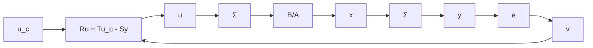

$$H _ {f f} (z) = \frac {B _ {m} (z) A (z)}{A _ {m} (z) B (z)} = \frac {\bar {B} _ {m} (z) A (z)}{A _ {m} (z) B ^ {+} (z)} \tag {5.30}$$

and a feedback from the model error $e = y_{m} - y$ with the pulse-transfer function

$$H _ {f b} (z) = \frac {A ^ {+} (z) \bar {S} (z)}{\bar {B} ^ {+} (z) \bar {R} (z)} \tag {5.31}$$

The polynomials $\bar{R}$ and $\bar{S}$ are obtained from (5.28). The controller corresponds to the general structure of a two-degree-of-freedom controller shown in Fig. 5.2. The response to disturbances is governed by the polynomials $\tilde{A}_{c}$ and $\tilde{A}_{o}$ and the response to command signals is given by the pulse-transfer function $B_{m}/A_{m}$ . Notice that the controller cannot be implemented by the separate blocks shown in the figure, because each separate block is not causal.

flowchart

Figure 5.3 Block diagram of a closed-loop system with command signals, load disturbances, and measurement errors.
