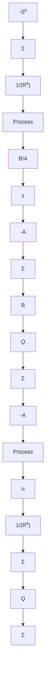

# Youla-Kučera Parameterization

The calculations made give an interesting characterization of stabilizing controllers. We have the following result.

THEOREM 5.2 YOULA-KUČERA PARAMETERIZATION Consider a system described by the transfer function $B(z) / A(z)$ . Let $S^0 (z) / R^0 (z)$ be a stabilizing controller. Then all rational stabilizing controllers are described by

$$\frac {S (z)}{R (z)} = \frac {S ^ {0} (z) + Q (z) A (z)}{R ^ {0} (z) - Q (z) B (z)} \tag {5.50}$$

where $Q(z)$ is stable.

Proof. We will first prove that the controller given by (5.50) is stable. To do so we introduce $Q(z) = Y(z)/X(z)$ , where $X(z)$ and $Y(z)$ are polynomials. It follows from the assumption that $X(z)$ has all its zeros inside the unit disc. The controller (5.50) can then be written as

$$\frac {S}{R} = \frac {X S ^ {0} + Y A}{X R ^ {0} - Y B}$$

where we have dropped the argument to simplify the writing. This controller gives a closed-loop system with the characteristic polynomial

$$A R + B S = A (X R ^ {0} - Y B) + B (X S ^ {0} + Y A) = X (A R ^ {0} + B S ^ {0})$$

This polynomial has all its roots inside the unit disc because X is stable and $AR^{0} + BS^{0}$ is also stable. To prove that all stabilizing controllers can be written as (5.50) with Q stable, consider a stabilizing control S/R that gives a closed-loop system with the characteristic polynomial

flowchart

Figure 5.7 Block diagram that illustrates Youla-Kučera's characterization of all stabilizing controllers.

$$A R + B S = C$$

It follows from (5.50) that

$$S R ^ {0} - Q S B = R S ^ {0} + Q R A$$

Hence

$$Q = \frac {S R ^ {0} - R S ^ {0}}{A R + B S} = \frac {S R ^ {0} - R S ^ {0}}{C}$$

which is stable because polynomial C has all its zeros inside the unit disc.

This theorem is often quite useful in control system design because it gives a simple way of characterizing all stabilizing controllers. The block diagram in Fig. 5.7 illustrates the theorem.
