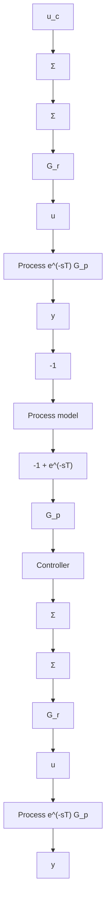

# Example 5.11 Smith-predictor

A time-delay process is described in Example A.4. The process can, for instance, represent a paper machine. Assume that the process in (A.10) has a delay of 2 time units and that the sampling time is h = 1. The system is then described by the model

$$y (k + 1) = 0. 3 7 y (k) + 0. 6 3 u (k - 2)$$

flowchart

Figure 5.29 Block diagram of a Smith-predictor.

  
Figure 5.30 PI-control (dashed) and Smith-predictor control (solid) of the process in Example 5.11 with a time delay.

(see Example 2.6). If there were no time delays, a PI-controller with gain 0.4 and integration time $T_{i} = 0.4$ would give good control. This PI-controller will not give good control if the process has a time delay. To obtain good PI-regulation, it is necessary to have a gain of 0.1 and $T_{i} = 0.5$ . The response of this controller is illustrated in Fig. 5.30. The set point is changed at $t = 0$ and a step disturbance is introduced in the output at $t = 20$ . In Fig. 5.30 we also show the response of the Smith-predictor. Notice that the step response is faster and that the system recovers faster from the load disturbance.

Having found that the Smith-predictor can be effective we will now proceed to analyze it from the point of view of pole placement. Consider a process with the pulse-transfer function

$$H (z) = \frac {B (z)}{A (z)} = \frac {B (z)}{z ^ {d} A ^ {\prime} (z)} = \frac {B ^ {\prime} (z)}{z ^ {d} A ^ {\prime} (z)} \tag {5.61}$$

where the polynomial $\deg A' > \deg B$ .

First, design a controller for the system $B(z) / A'(z)$ without delay to give a closed-loop characteristic polynomial $A_{cl}'$ . The Diophantine equation (5.4) for this problem becomes

$$A ^ {\prime} R ^ {\prime} + S ^ {\prime} R ^ {\prime} = A _ {c l} ^ {\prime} \tag {5.62}$$

furthermore we have $T' = t_{0}A_{0}$ .
