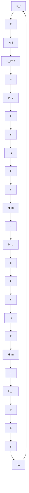

# Internal-Model Control

The internal model controller (IMC) is a control structure that has been particularly popular in process control. A block diagram of the system is shown in Fig. 5.31. The idea is conceptually simple and attractive. It follows from the figure that if $H_{p} = H_{m}$ , then the signal $\varepsilon$ does not depend on the control signal. Moreover it is identical to the disturbance $e$ . Perfect compensation of the disturbance is then obtained if $H_{m}^{\dagger}$ is chosen as the inverse of $H_{p}$ . Such a controller is not realizable and some approximate inverse is therefore chosen. It is also common to introduce a filter $H_{f}$ in the loop, as is shown in the figure. The controller in the dashed lines has the pulse-transfer function

$$\boldsymbol {H} _ {c} = \frac {\boldsymbol {H} _ {f} \boldsymbol {H} _ {m} ^ {\dagger}}{\mathbf {1} - \boldsymbol {H} _ {f} \boldsymbol {H} _ {m} ^ {\dagger} \boldsymbol {H} _ {m}}$$

flowchart

Figure 5.31 Block diagram of a process with a controller based on the internal model principle.

The controller can be interpreted as a pole-placement controller with cancellation of process poles and zeros. Assume that the process has the pulse-transfer function

$$H _ {p} = \frac {B}{z ^ {d} A ^ {\prime}} \tag {5.67}$$

where the polynomials A and B are chosen so that $\deg A' = \deg B$ . Furthermore consider the ideal case when $H_{m} = H_{p}$ . An approximate realizable system inverse is then

$$H _ {m} ^ {\dagger} = \frac {A ^ {\prime}}{B} \tag {5.68}$$

Furthermore let the filter be

$$H _ {f} = \frac {B _ {f}}{A _ {f}} \tag {5.69}$$

Simple calculations show that the controller is in the standard form (5.2) with

$$R = (A A _ {f} - A ^ {\prime} B _ {f}) BS = A A ^ {\prime} B _ {f} \tag {5.70}\boldsymbol {T} = \boldsymbol {S}$$

Notice that if the filter has unit static gain, that is, $H_{f}(1) = 1$ , it follows that $R(1) = 0$ , which implies that the controller has integral action.

The closed-loop characteristic polynomial is

$$A R + B S = A ^ {2} B A _ {f} \tag {5.71}$$

The closed-loop poles are thus equal to the poles and zeros of the process, the poles of the model and the poles of the filter $H_{f}$ . The poles and zeros of the process must thus be stable and well damped. Notice the similarities with the Youla-Kučera parameterization in Fig. 5.7.

There are many different versions of the internal model controller. They differ in the way the approximate inverse is computed and in the selection of the filter $H_{f}$ .
