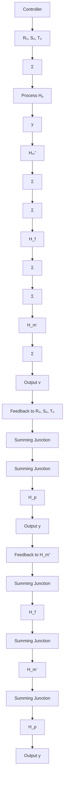

# The Torque Observer

The torque observer shown in Fig. 5.32 is a control scheme for motion-control systems that is similar to the IMC. The idea is that disturbances in motion-control systems typically appear as torques at the process input. The idea is similar to the IMC. The transfer function $H_{m}$ is a model of the process, $H^{-}$ is the noninvertible part of $H_{m}$ , and $H_{m}^{\dagger}$ is an approximate inverse of $H_{m}$ . The error $\varepsilon$ is identical to the disturbance torque $v$ if $H^{-} = 1$ and $H_{m}^{\dagger}$ is an exact inverse. If the process cannot be inverted exactly $\varepsilon$ is an approximation of $v$ . This disturbance is then compensated by feedback through filter $H_{f}$ . Assume that the pulse-transfer function is given by (5.67), that $H_{m} = H_{p}$ . Then $H^{-} = z^{-d}$ , the inverse $H^{\dagger}$ is given by Eq. (5.68), and the filter is given by Eq. (5.69). Simple calculations show that the controller can be written on the standard form with

$$R = (z ^ {d} A _ {f} - B _ {f}) B R _ {0}S = z ^ {d} A _ {f} B S _ {0} + A B _ {f} R _ {0} \tag {5.72}\boldsymbol {S} = \boldsymbol {z} ^ {d} \boldsymbol {A} _ {f} \boldsymbol {B} \boldsymbol {T} _ {0}$$

If the filter has unit static gain we have $A_{f}(1) = B_{f}(1)$ , which implies that $R(1) = 0$ and that the controller has integral action.

The closed-loop characteristic polynomial is

$$A R + B S = z ^ {d} A _ {f} B (A R _ {0} + B S _ {0}) \tag {5.73}$$

flowchart

Figure 5.32 Block diagram of a process with a controller based on a torque observer.

The closed-loop poles are thus the poles of the system without the torque observer, the process zeros, and the poles of the filter $H_{f}$ . We must thus require that the filter is stable and that the process has no unstable zeros. It is straightforward to avoid these assumptions by applying a general pole-placement algorithm. Also notice the similarities with the Youla-Kučera parameterization in Fig. 5.7.
