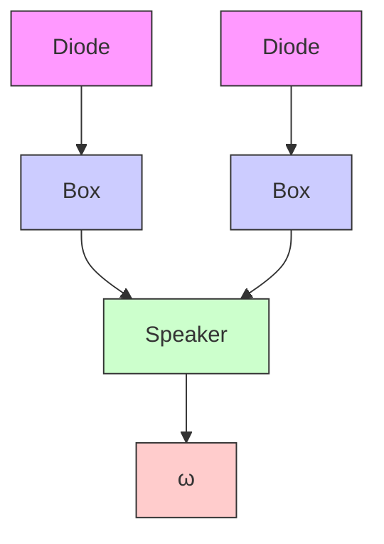

# Example 6.6 Control of a drum boiler

Consider a turbine and a generator, which are driven by a drum boiler. The control system can have different structures, as illustrated in Fig. 6.1, which shows three control modes: boiler follow, turbine follow, and sliding pressure control. The system has two key control variables, the steam valve and the oil flow. In the boiler follow mode, the generator speed, $\omega$ , is controlled directly by feedback to the turbine valve, and the oil flow is controlled to maintain the steam pressure, p. In the turbine follow mode, the generator speed is used instead to control the oil flow to the boiler, and the steam valve is used to control the drum pressure. In sliding pressure control, the turbine valve is fully open, and oil flow is controlled from the generator speed.

The boiler follow mode admits a very rapid control of generator speed and power output because it uses the stored energy in the boiler. There may be rapid pressure and temperature variations, however, that impose thermal strains on the turbine and the boiler. In the turbine follow mode, steam pressure is kept constant and thermal stresses are thus much smaller. The response to power demand will, however, be much slower. The sliding pressure control mode may be regarded as a compromise between boiler follow and turbine follow.

flowchart

text_image

(b)
p
ω

text_image

(c)
p
ω

Figure 6.1 Control modes for a boiler-turbine unit: (a) boiler follow, (b) turbine follow, and (c) sliding pressure.
