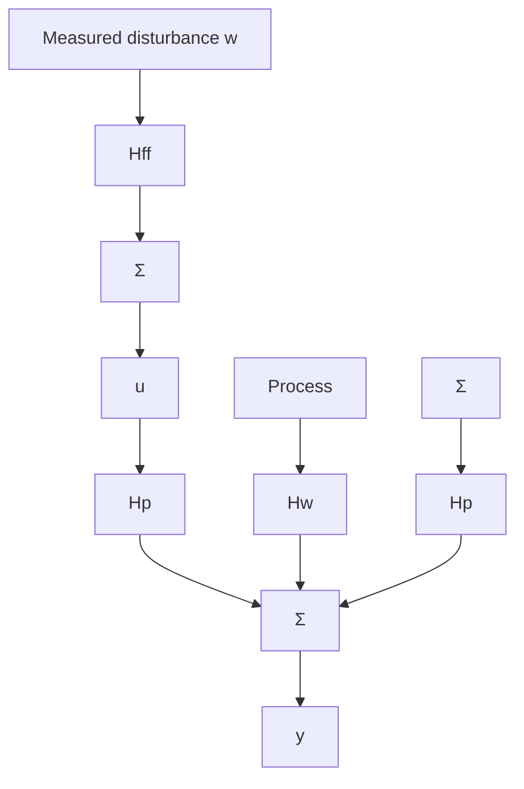

# Feedback

The feedback loops used include, for example, simple PID controllers and their cascade combinations. When digital computers are used to implement the controllers, it is also easy to use more sophisticated control, such as Smith-predictors for dead-time compensation, state feedback, and model reference control. Feedback is used in the usual context. Its advantage is that sensitivity to disturbances and parameter variations can be reduced. Feedback is most effective when the process dynamics are such that a high bandwidth can be used. Many systems that are difficult to implement using analog techniques may be easy to implement using computer-control technology.

flowchart

Figure 6.3 Reduction of disturbances by feedforward.
