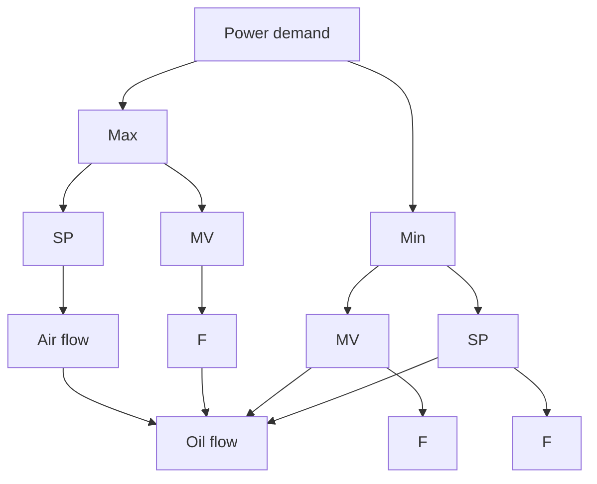

# Selector Control

There are many cases in which it is desirable to switch control modes, depending on the operating condition. This can be achieved by a combination of logic and feedback control. The same objective can, however, also be achieved with a combination of feedback controllers. A typical example is control of the air-to-fuel ratio in boiler control. In ship boilers it is essential to avoid smoke puffs when the ship is in the harbor. To do this it is essential that the air flow leads the oil flow when load is increased and that the air flow lags the oil flow when the load is decreased. This can be achieved with the system shown in Fig. 6.4, which has two selectors. The maximum selector gives an output signal that at each instant of time is the largest of the input signals, and the minimum selector chooses the smallest of the inputs. When the power demand is increased, the maximum selector chooses the demand signal as the input to the air-flow controller, and the minimum selector chooses the air flow as the set point to the fuel-flow controller. The fuel will thus follow the actual air flow.

flowchart

Figure 6.4 System with selectors for control of the air-to-fuel ratio in a boiler.

When the power demand is decreased, the maximum selector will choose the fuel flow as the set point to the air-flow controller, and the minimum selector will choose the power demand as the set point to the fuel-flow controller. The air flow will thus lag the fuel flow.

Control using selectors is very common in industry. Selectors are very convenient for switching between different control modes.
