# Combinations

When using a bottom-up approach, the basic control structures are combined to obtain a solution to the control problem. It is often convenient to make the combinations hierarchically. Many combinations, like cascade control, state feedback, and observers, are known from elementary control courses. Very complicated control systems can be built up by combining the simple structures. An example is shown in Fig. 6.5. This way of designing control using the bottom-up

```mermaid
graph TD
    A["Feedforward"] --> B["Vessel feed"]
    B --> C["Pressurizing inlet"]
    C --> D["Press"]
    D --> E["Temp"]
    E --> F["PC"]
    E --> G["TC"]
    F --> H["Selector"]
    G --> H
    H --> I["Δ (Variable structure)"]
    I --> J["Feed-forward"]
    J --> K["Combining unit"]
    K --> L["FC"]
    L --> M["Flow"]
    M --> N["✓"]
    N --> O["FC"]
    O --> P["Flow"]
    P --> Q["Δ (Variable structure)"]
    Q --> R["Selector"]
    R --> S["PC"]
    R --> T["TC"]
    S --> U["Combining unit"]
    T --> U
    U --> V["FC"]
    V --> W["Flow"]
    W --> X["✓"]
    X --> Y["FC"]
    Y --> Z["Flow"]
    Z --> AA["Δ (Variable structure)"]
    AA --> AB["Selector"]
    AB --> AC["PC"]
    AB --> AD["TC"]
    AC --> AE["Combining unit"]
    AD --> AE
    AE --> AF["FC"]
    AF --> AG["Flow"]
    AG --> AH["✓"]
    AH --> AI["FC"]
    AI --> AJ["Flow"]
    AJ --> AK["Δ (Variable structure)"]
    AK --> AL["Selector"]
    AL --> AM["PC"]
    AL --> AN["TC"]
    AM --> AO["Combining unit"]
    AN --> AO
    AO --> AP["FC"]
    AP --> AQ["Flow"]
    AQ --> AR["✓"]
    AR --> AS["FC"]
    AS --> AT["Flow"]
    AT --> AU["Δ (Variable structure)"]
    AU --> AV["Selector"]
    AV --> AW["PC"]
    AV --> AX["TC"]
    AW --> AY["Combining unit"]
    AX --> AZ["FC"]
    AZ --> BA["Flow"]
    BA --> BB["✓"]
    BB --> BC["FC"]
    BC --> BD["Flow"]
    BD --> BE["Δ (Variable structure)"]
    BE --> BF["Selector"]
    BF --> BG["PC"]
    BF --> BH["TC"]
    BG --> BI["Combining unit"]
    BH --> BJ["FC"]
    BJ --> BK["Flow"]
    BK --> BL["✓"]
    BL --> BM["FC"]
    BM --> BN["Flow"]
    BN --> BO["Δ (Variable structure)"]
    BO --> BP["Selector"]
    BP --> BQ["PC"]
    BP --> BR["TC"]
    BQ --> BS["Combining unit"]
    BS --> BT["FC"]
    BT --> BU["Flow"]
    BU --> BV["✓"]
    BV --> BW["FC"]
    BW --> BX["Flow"]
```

flowchart

Figure 6.5 An example of a complicated control system built up from simple control structures. (Redrawn from Foxboro Company with permission.)

