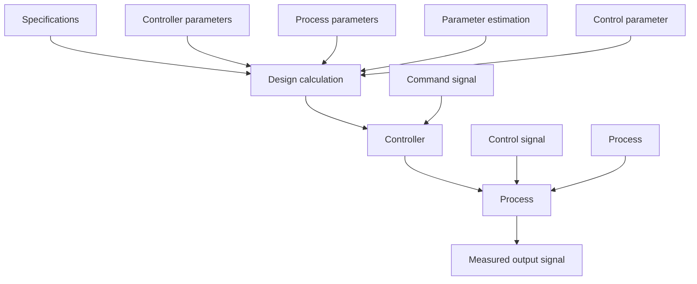

flowchart

Figure 6.6 Block diagram of an adaptive controller obtained by combining a parameter estimator with a design calculation.

approach is in fact the technique predominantly used in process control. Its success depends largely on the experience and skill of the designer.

An adaptive system, which is obtained by combining a parameter estimator with a design procedure, is shown in Fig. 6.6.
