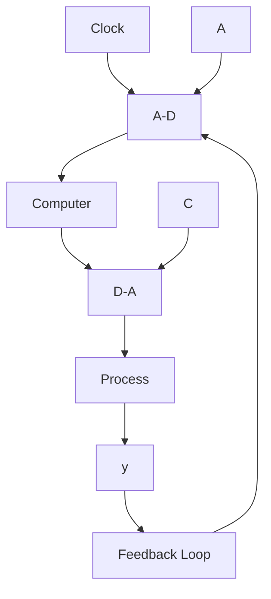
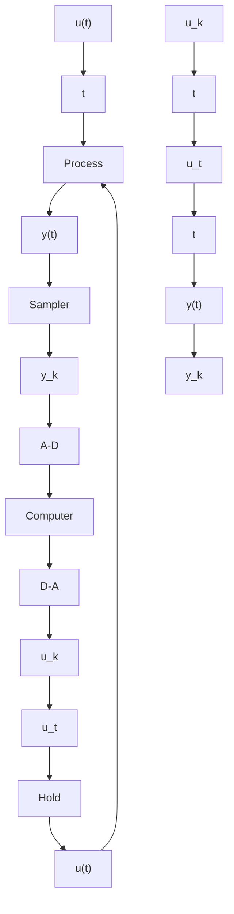

# 7.2 A Computer-Controlled System

A schematic diagram of a computer-controlled system is given in Fig. 7.1. In Chapter 2 the loop is cut inside the computer between the A-D and D-A converters —for example, at C in the figure. In this chapter the loop is instead cut on the analog side —for example, at A in the figure. The discussions of this chapter require a more detailed description of the sequence of operations in a computer-controlled system. The following events take place in the computer:

1. Wait for a clock pulse.   
2. Perform analog-to-digital conversion.   
3. Compute control variable.   
4. Perform digital-to-analog conversion.   
5. Update the state of the regulator.   
6. Go to step 1.

Because the operations in the computer take some time, there is a time delay between steps 2 and 4. The relationships among the different signals in the system are illustrated in Fig. 7.2. When the control law is implemented in a computer it is important to structure the code so that the calculations required in step 3 are minimized (see Chapter 9).

It is also important to express the synchronization of the signals precisely. For the analysis the sampling instants have been arbitrarily chosen as the time when the D-A conversion is completed. Because the control signal is discontinuous, it is important to be precise about the limit points. The convention of continuity from the right was adopted. Notice that the real input signal to the process is continuous because of the nonzero settling time of the D-A converter and the actuators.

flowchart

Figure 7.1 Schematic diagram of a computer-controlled system.

flowchart

Figure 7.2 Relationships among the measured signal, control signal, and their representations in the computer.
