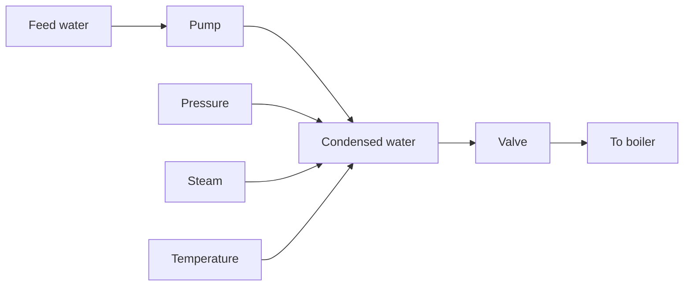

An illustration of the aliasing effect is shown in Fig. 7.8. Two signals with the frequencies 0.1 Hz and 0.9 Hz are sampled with a sampling frequency of 1 Hz (h = 1 s). The figure shows that the signals have the same values at the sampling instants. Equation (7.10) gives that 0.9 has the alias frequency 0.1. The aliasing problem was also seen in Fig. 1.11.

line

| Time | Value |
| --- | --- |
| 0 | 0 |
| 1 | 1 |
| 2 | 0 |
| 3 | -1 |
| 4 | 0 |
| 5 | 1 |
| 6 | 0 |
| 7 | -1 |
| 8 | 0 |
| 9 | 1 |
| 10 | 0 |

Figure 7.8 Two signals with different frequencies, 0.1 Hz and 0.9 Hz, may have the same value at all sampling instants.

flowchart

Figure 7.9 Process diagram for a feed-water heating system of a boiler.
