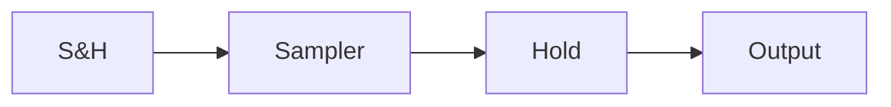

# A Mathematical Idealization

The pulse-modulation scheme is easy to simulate but difficult to analyze. A more easily used mathematical idealization will therefore be introduced. It seems reasonable to design the sample-and-hold circuit so that the pulse width $\tau$ is much shorter than the sampling period. It also seems reasonable to choose the time constant RC to be shorter than the pulse width. The current through the capacitor will then consist of short pulses. Both the height and the time integral of a pulse are proportional to the difference u - y between the input voltage u and the capacitor voltage y at the sampling instant.

  
Figure 7.18 Simulation of a sample-and-hold circuit. The pulse width is 0.05 s and the time constant is RC = 0.01 s. (a) The continuous-time signal (dashed) and the output of the sample-and-hold circuit (solid); (b) the current $i(t)$ in the sample-and-hold circuit; (c) the modulation function $m(t)$ .

In the idealization, the current pulses are replaced by impulses. For simplicity the integral of the impulse is chosen to be proportional to the value of the input signal u at the sampling instant. The capacitor is then replaced by an integrator. Because the pulses were chosen to be proportional to u and not to u - y, it is necessary to reset the integral to zero when a new pulse arrives. The current is then represented as

$$u ^ {*} = u m \tag {7.25}$$

where

$$m (t) = \sum_ {k = - \infty} ^ {\infty} \delta (t - k h) \tag {7.26}$$

and $\delta$ is a delta function [compare with (7.24)]. The signal $u^{*}$ is called the sampled representation of the continuous signal u. It is useful to remember that $u^{*}$ is related to the current through the capacitor of the sample-and-hold circuit in Fig. 7.15.

flowchart

Figure 7.19 Block diagram of a sample-and-hold circuit and its idealized representation.

The signal $u^{*}$ can be thought of as a modulation of u with a carrier signal in the form of an impulse train. The model is therefore called the impulse-train modulation model. The signal $u^{*}$ carries the same information as the sequence $\{u(kh), k = \ldots, -1, 0, 1, \ldots\}$ . Notice, however, that $u^{*}$ is a (generalized) time function. The signal $u^{*}$ is introduced to represent a sampled signal in a form that can be processed by linear filtering.

