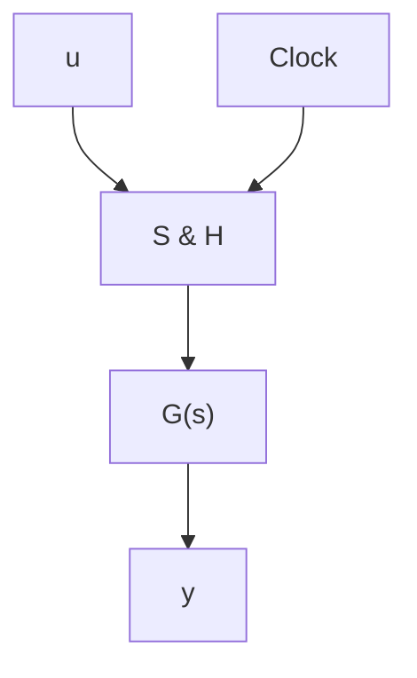
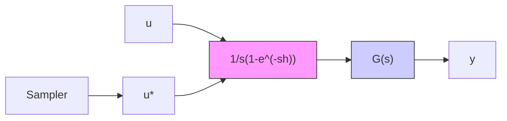

# Input-Output Relationships

Once a convenient representation of a sample-and-hold circuit is obtained, the response of a sampled-data system to an arbitrary input signal can be computed. Consider the system shown in Fig. 7.20(a), which is composed of a sample-and-hold circuit connected to a time-variant linear dynamic system with the transfer function G. This is a typical representation of a sampler and a D-A converter connected to a process. Use of the impulse-modulation model of the sample-and-hold circuit allows the system to be represented as in Fig. 7.20(b).

flowchart

(b)

flowchart

$F(s)$   
Figure 7.20 (a) Schematic diagram of a sample-and-hold circuit connected to a linear system and (b) its representation using the idealized model of a sample-and-hold circuit.

Let u be the input, y the output, and F the transfer function of the combination of the zero-order-hold circuit and the process, that is,

$$F (s) = \frac {1}{s} (1 - e ^ {- s h}) G (s) \tag {7.28}$$

The input-output relationship is easily determined using transform theory. The Laplace transform of $u^{*}$ is given by

$$U ^ {*} (s) = \int_ {0} ^ {\infty} e ^ {- s t} u ^ {*} (t) d t = \sum_ {k = 0} ^ {\infty} e ^ {- s k h} u (k h)$$

The Laplace transform of the output signal is then given by

$$Y (s) = F (s) \sum_ {k = 0} ^ {\infty} e ^ {- s k h} u (k h) \tag {7.29}$$

It is thus straightforward to calculate the Laplace transform of the output signal. Notice, however, that it is not possible to factor out the Laplace transform of the signal u on the right-hand side of (7.29). This means that the input-output relationship of the system cannot be characterized by an ordinary transfer function. This is because the system is not time-invariant. How to get around this problem is discussed in Sec. 7.8.
