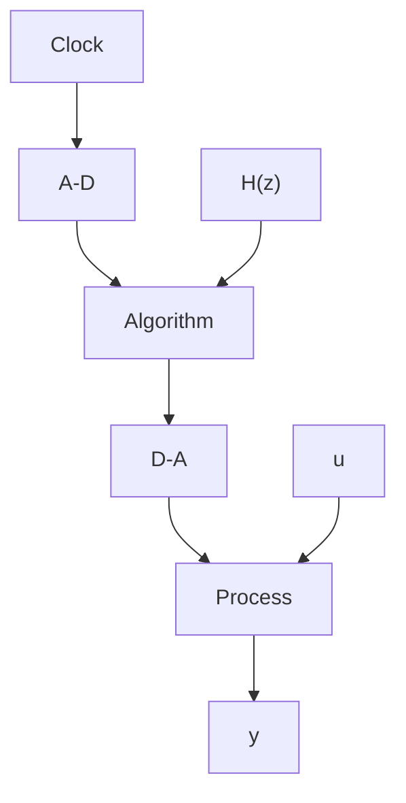

The fact that the signal transmission at the Nyquist frequency $\omega_{N}$ critically depends on $\varphi$ —that is, how the sinusoidal input signal is synchronized with respect to the sampling instants—is illustrated in Fig. 7.22.

There may be interference between the sidebands and the fundamental frequency that can cause the output of the system to be very irregular. A typical illustration of this was given in Example 1.4. In this case the fundamental component has the frequency 4.9 Hz and the Nyquist frequency is 5 Hz. The interaction between the fundamental component and the lowest sideband, which has the frequency 5.1 Hz, will produce beats with the frequency 0.1 Hz. This is clearly seen in Fig. 1.12.

If the sideband frequencies are filtered out, the sampled system appears as a linear time-invariant system except at frequencies that are multiples of the Nyquist frequency, $\omega_{s}/2$ . At this frequency the amplitude ratio and the phase lag depend on the phase shift of the input relative to the sampling instants.

If an attempt is made to determine the frequency response of a sampled system using frequency response, it is important to filter out the sidebands efficiently. Even with perfect filtering, there will be problems at the Nyquist frequency. The results depend critically on how the input is synchronized with the clock of the computer.

flowchart

Figure 7.23 Open-loop computer-controlled system.
