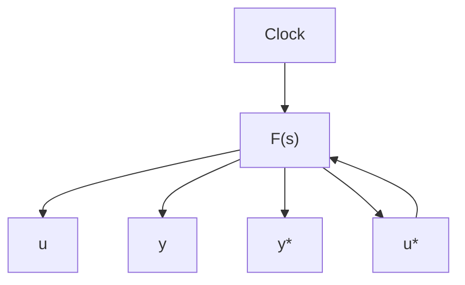

$$v _ {k} = s + \frac {2 \pi i k}{h} = s + i k \omega_ {s} \quad k = \dots - 1, 0, 1, \dots$$

The residues at these poles are

$$\frac {1}{h} F \left(s + \frac {2 \pi i k}{h}\right)$$

Summation of the residues now gives (7.33).

Remark 1. Notice that Eq. (7.33) can also be written as

$$F ^ {*} (s) = \frac {1}{h} \left(F (s) + F (s + i \omega_ {s}) + F (s - i \omega_ {s}) + \dots\right)$$

Remark 2. Notice that if F is analytic for Re s < -γ₀, the integration path in (7.34) may be closed by a large semicircle to the left. The following formula is obtained:

$$\tilde {F} (z) = \sum_ {\text { Poles of } F} \operatorname{Res} \left(F (s) \frac {z}{z - \exp (s h)}\right)$$

This gives a proof of formula (2.31).

flowchart

Figure 7.29 Block diagram of a system with two samplers.

Remark 3. The theorem can be extended to the case in which the function $F$ goes to zero as $1 / |s|$ for large $|s|$ . Equation (7.33) is then replaced by

$$F ^ {*} (s) = \frac {1}{h} \sum_ {k = - \infty} ^ {\infty} F (s + i k \omega_ {s}) + \frac {1}{2} f (0 +)$$

Remark 4. In the literature the same notation is sometimes used for the functions $F^{*}$ and $F$ . This is confusing and should be avoided.

Remark 5. Notice that (7.33) is closely related to (7.3) for the Fourier transform of a sampled signal.

Pulse-transfer functions. Section 7.6 shows that the input-output relationship of a sampler followed by a linear transfer function is given by Eq. (7.29). This equation cannot be described by a transfer function. If a fictitious sampler is added to the system output, the configuration shown in Fig. 7.29 is obtained. For this system it is possible to define a transfer function. The input-output relationship is given by

$$y ^ {*} (t) = \left(f (t) * u ^ {*} (t)\right) ^ {*}$$

The following theorem is useful for obtaining the corresponding transforms.

THEOREM 7.3 Let $f$ and $g$ be functions that have Laplace transforms and let $m$ be the modulation function corresponding to an impulse train. Then

$$m (t) \left(f (t) * (m (t) g (t))\right) = (m (t) f (t)) * (m (t) g (t)) \tag {7.35}$$

or, equivalently,

$$\left(f (t) * g ^ {*} (t)\right) ^ {*} = f ^ {*} (t) * g ^ {*} (t) \tag {7.36}$$
