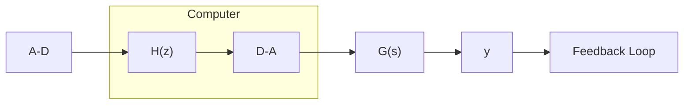
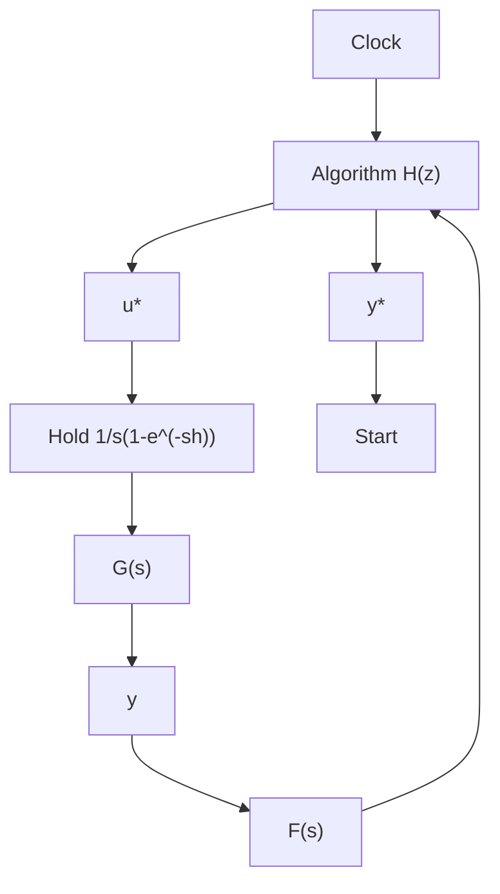

# Example 7.10 Translation of a simple computer-controlled system

Consider the standard configuration of a computer-controlled system shown in Fig. 7.30(a). The process is characterized by a linear transfer function G, and the calculations performed in the computer are represented by a pulse-transfer function H. The analog and digital parts of the system are, as usual, connected via D-A and A-D converters. To apply the formalism, the A-D converter is represented by an ideal sampler. The computer is represented as a system that transforms an impulse-modulated signal to another impulse-modulated signal. The D-A converter is represented by a sampler, followed by a zero-order hold. It is assumed that the samplers are perfectly synchronized. The block diagram shown in Fig. 7.30(h) is then obtained. The analog parts are thus the hold and the process. Their combined transfer function is

$$F (s) = \frac {1}{s} (1 - e ^ {- s h}) G (s)$$

The Laplace transform Y of the output y is given by

$$Y (s) = F (s) U ^ {i} (s)$$

(a)   


<details>
<summary>flowchart</summary>


</details>

(b)   


<details>
<summary>flowchart</summary>


</details>

(c)


<details>
<summary>flowchart</summary>

```mermaid
graph LR
    A["H(z)"] --> B["{u(kh)}"]
    B --> C["F̃(z)"]
    C --> D[{y(kh)}
```
</details>

Figure 7.30 Standard configuration of a computer-controlled system.

The sampled output has the transform

$$Y ^ {*} (s) = \left(F (s) U ^ {*} (s)\right) ^ {*} = F ^ {*} (s) U ^ {*} (s)$$

where (7.37) is used to obtain the last equality. The relationship between $y^{*}$ and $u^{*}$ can thus be represented by the pulse-transfer function

$$\tilde {F} (z) = F ^ {*} (s) \mid_ {s = (\ln z) / h}$$

The calculations in the computer can furthermore be represented by the pulse-transfer function $H(z)$ . If the loop is cut in the computer the pulse-transfer function is thus

$$\boldsymbol {H} (z) \bar {\boldsymbol {F}} (z)$$

A block diagram of the properties of the system that can be seen from the computer is shown in Fig. 7.30(c). By considering all signals as sequences like $\{y(kh), k = \ldots - 1, 0, 1, \ldots\}$ and by introducing appropriate pulse-transfer functions for the algorithm and the process with the sample-and-hold, a representation that is equivalent to the ordinary block-diagram representation of continuous-time systems was thus obtained.

A further illustration is given by a slightly more complicated example
