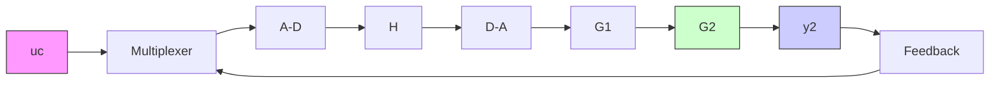
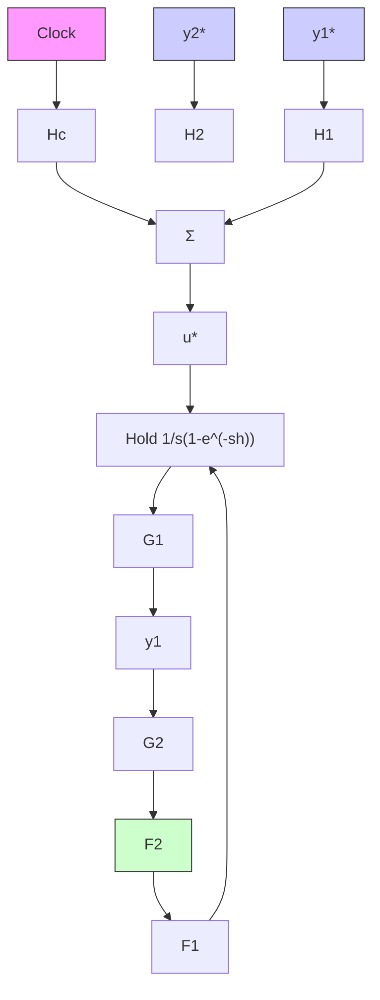
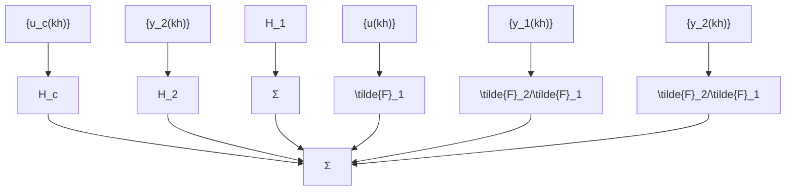

# Modified z-Transforms

The problem of sampling a system with a delay can be handled by the modified z-transform defined in Definition 2.2. The modified z-transform is useful for many purposes—for example, the intersample behavior can easily be investigated using these transforms. There are extensive tables of modified z-transforms and many theorems about their properties (see the References).

(a)   

flowchart

flowchart

(c)   

flowchart

Figure 7.31 Computer-controlled system with multiplexer and two feedback loops and equivalent block diagram.
