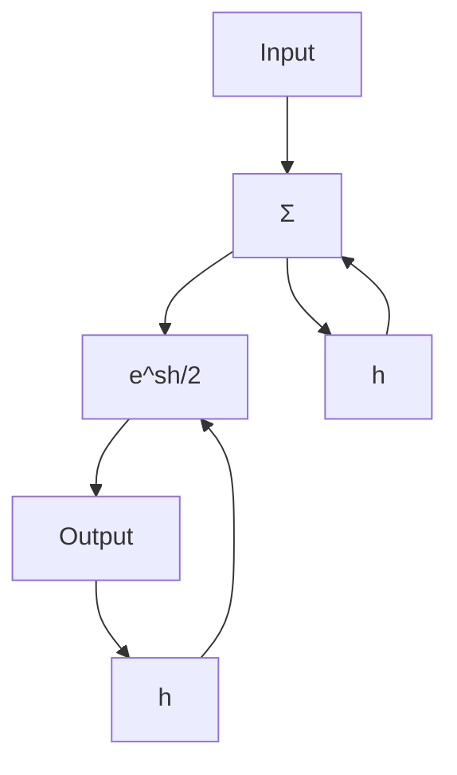
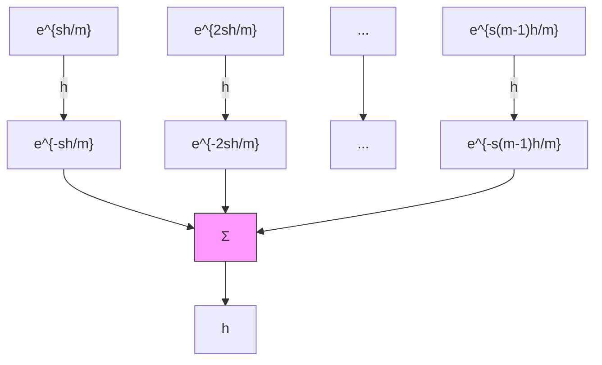

# Input-Output Methods

Multirate systems can also be investigated by input-output analysis. First, observe as before that the system is periodic with period h if the ratios of the sampling periods are rational numbers. The values of the system variables at times that are synchronized to the period can then be described as a time-invariant dynamic system. Ordinary operator or transfer-function methods for linear systems can then be used. The procedure for analyzing a system can be described as follows: A block diagram of the system including all subsystems and all samplers is first drawn. The period h is determined. All samplers appearing in the system then have periods h/m, where m is an integer. A trick called switch decomposition is then used to convert samplers with rate h/m to a combination of samplers with period h. The system can then be analyzed using the methods described in Sec. 7.8.

(a)   

flowchart

(b)   

flowchart

Figure 7.33 Representation of samplers with periods (a) h/2 and (b) h/m by switch decomposition.
