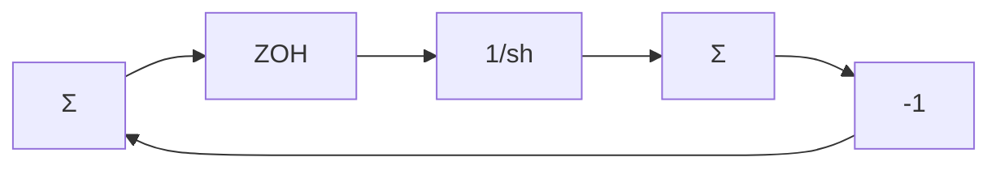

# 7.1 The signal

$$f (t) = a _ {1} \sin 2 \pi t + a _ {2} \sin 2 0 t$$

is the input to a zero-order sample-and-hold circuit. Which frequencies are there at the output if the sampling period is h = 0.2?

7.2 A signal that is going to be sampled has the spectrum shown in Fig. 7.34. Of interest are the frequencies in the range from 0 to $f_{1}$ Hz. A disturbance has a fixed known frequency with $f_{2} = 5f_{1}$ . Discuss choice of sampling interval and presampling filter.

text_image

0
f₁
f₂

Figure 7.34

7.3 Show that the system in Fig. 7.35 is an implementation of a first-order hold and determine its response to a pulse of unit magnitude and a duration of one sampling interval.

flowchart

Figure 7.35

7.4 Sample a sinusoidal signal $u(t) = \sin(t)$ using zero-order hold, first-order hold, and predictive first-order hold. Compare the different hold circuits when the sampling period is changed.   
7.5 The magnitude of the spectrum of a signal is shown in Fig. 7.36. Sketch the magnitude of the spectrum when the signal has been sampled with (a) $h = 2\pi / 10 \, \text{s}$ , (b) $h = 2\pi / 20 \, \text{s}$ , and (c) $h = 2\pi / 50 \, \text{s}$ .

line

| ω, rad/s | φ(ω) |
| --- | --- |
| 0 | 1 |
| 10 | 0 |

Figure 7.36

7.6 Consider the signal in Problem 7.5, but let the spectrum be centered around $\omega = 100$ rad/s and with (a) $\omega_{s} = 120$ rad/s and (b) $\omega_{s} = 240$ rad/s.

7.7 A camera is used to get a picture of a rotating wheel with a mark on it. The wheel rotates at r revolutions per second. The camera takes one frame each h seconds. Discuss how the picture will appear when shown on a screen. (Compare with what you see in western movies.)

7.8 The signal $y(t) = \sin 3\pi t$ is sampled with the sampling period h. Determine h such that the sampled signal is periodic.

7.9 An amplitude modulated signal

$$u (t) = \sin (4 \omega_ {0} t) \cos (2 \omega_ {0} t)$$
