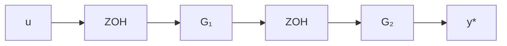
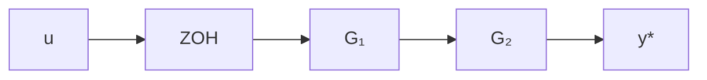
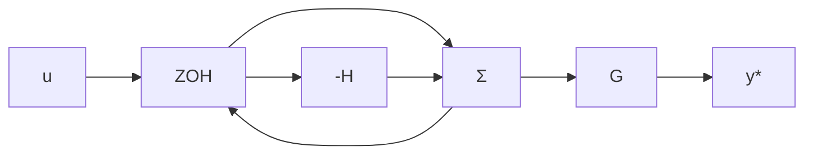

is sampled with $h = \pi/3\omega_{0}$ . Determine the frequencies $f, 0 \leq f \leq 3\omega_{0}/2\pi$ that are represented in the sampled signal.

7.10 Find $Y^{*}$ for the systems in Fig. 7.37.

flowchart

flowchart

flowchart

Figure 7.37

7.11 Write a program to compute the frequency response of a sampled-data system. Let the following be the input to the program:

(a) The polynomials in the pulse-transfer function $H(z)$ .   
(b) The sampling interval.   
(c) The maximum and minimum frequencies.

Use the program to plot $H(\exp(i\omega h))$ for the normalized motor sampled with a zero-order hold and compare with the continuous-time system.
