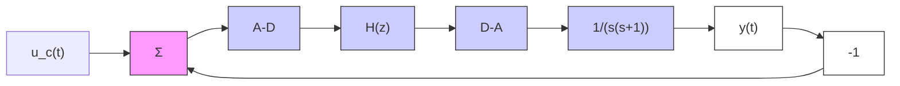

# Example 8.3 Digital redesign of lead compensator

Consider the system in Example A.2, which is a normalized model of a motor. The closed-loop transfer function

$$G _ {c} (s) = \frac {4}{s ^ {2} + 2 s + 4}$$

is obtained with the lead compensator

$$G _ {k} (s) = 4 \frac {s + 1}{s + 2} \tag {8.9}$$

The closed-loop system has a damping of $\zeta = 0.5$ and a natural frequency of $\omega_0 = 2\mathrm{rad / s}$ . The objective is now to find $H(z)$ in Fig. 8.5, which approximates (8.9). Euler's method gives the approximation

$$H _ {E} (z) = 4 \frac {z - 1 + h}{z - 1 + 2 h} = 4 \frac {z - (1 - h)}{z - (1 - 2 h)} \tag {8.10}$$

while Tustin's approximation gives

$$H _ {T} (z) = 4 \frac {(2 + h) z - 2 + h}{(2 + 2 h) z - 2 + 2 h} = 4 \frac {2 + h}{2 + 2 h} \cdot \frac {z - (2 - h) / (2 + h)}{z - (1 - h) / (1 + h)}$$

flowchart

Figure 8.5 Digital control of the motor example.

line

| Time | Output | Input |
| --- | --- | --- |
| 0 | 0 | 4 |
| 1 | 1 | 2 |
| 2 | 1.2 | 0 |
| 3 | 1.1 | -1 |
| 4 | 1 | -0.5 |
| 5 | 1 | 0 |
| 6 | 1 | 0 |
| 7 | 1 | 0 |
| 8 | 1 | 0 |
| 9 | 1 | 0 |
| 10 | 1 | 0 |

Figure 8.6 Process output, $y(t)$ , when the motor is controlled using the compensator of (8.10) when h = 0.1 (dashed-dotted), 0.25 (solid), and 0.5 (dotted). The control signal is shown for h = 0.25. For comparison, the continuous-time signals are also shown (dashed).

Finally, zero-order-hold sampling of (8.9) gives

$$H _ {\mathrm{zoh}} (z) = \frac {4 z - 2 (1 + e ^ {- 2 h})}{z - e ^ {- 2 h}} = 4 \frac {z - 0 . 5 (1 + e ^ {- 2 h})}{z - e ^ {- 2 h}}$$

All approximations have the form

$$H (z) = \frac {b _ {0} z + b _ {1}}{z + a _ {1}}$$

The crossover frequency of the continuous-time process in cascade with the compensator (8.9) is $\omega_{c} = 1.6$ rad/s. The earlier rule of thumb gives a sampling period of about 0.1 to 0.3 s.
