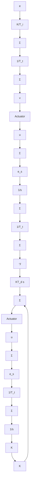
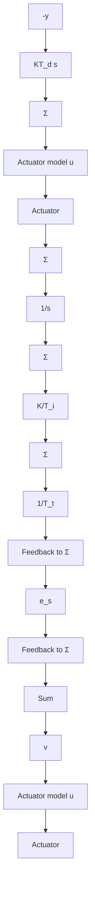

flowchart

Figure 8.10 Controller with antiwindup. A system in which the actuator output is measured is shown in (a) and a system in which the actuator output is estimated from a mathematical model is shown in (b).

equivalent signal can be generated from the model, as shown in Fig. 8.10(b). Fignre 8.9 shows the improved behavior with controllers having an anti-windup scheme. Antiwindup is further discussed in Sec. 9.4.
