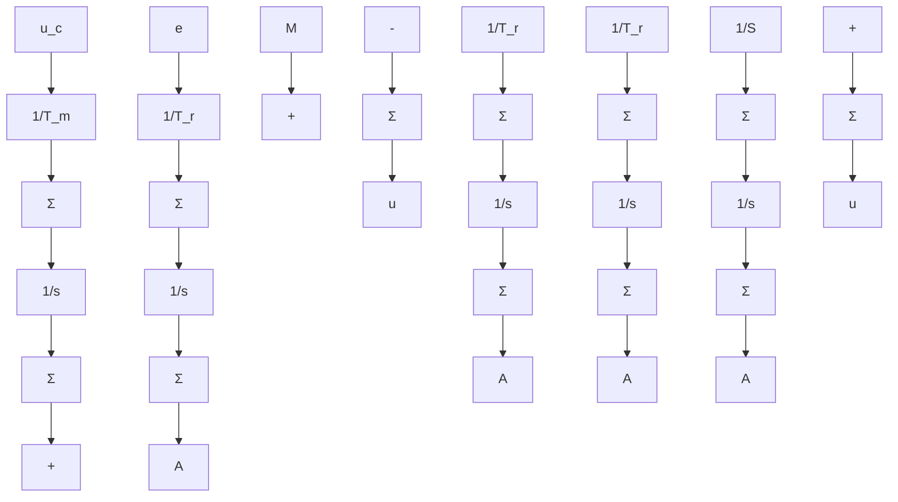

Figure 8.12 PID-controller with bumpless switching between manual and automatic control.

$$\frac {1}{1 - \frac {1}{1 + s T _ {i} ^ {\prime}}} = \frac {1 + s T _ {i} ^ {\prime}}{s T _ {i} ^ {\prime}}$$

For simplicity the filters are shown in continuous-time form. In a digital system they are of course realized as sampled systems. The system can also be provided with an antiwindup protection, as shown in Fig. 8.11(c). A drawback with this scheme is that the PID-controller must be of the form

$$G (s) = K ^ {\prime} \frac {(1 + s T _ {i} ^ {\prime}) (1 + s T _ {d} ^ {\prime})}{s T _ {i} ^ {\prime}} \tag {8.27}$$

which is less general than (8.22). Moreover the reset-time constant is equal to $T_{i}^{\prime}$ . More elaborate schemes have to be used for general PID-algorithms on position form. Such a controller is built up of a manual control module and a PID-module, each having an integrator. See Fig. 8.12.
