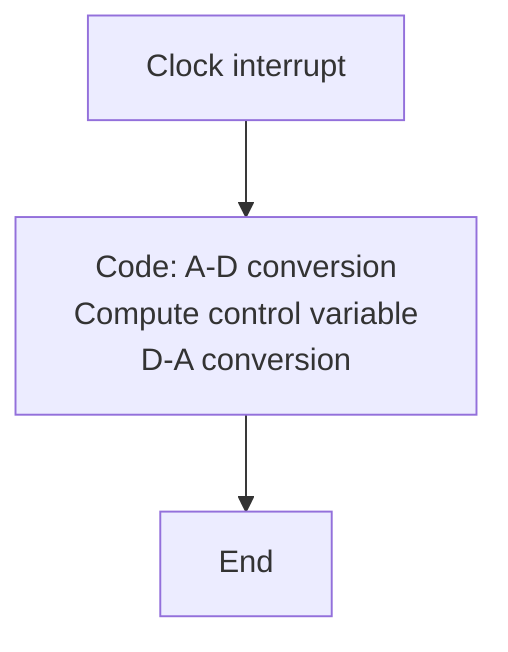

# Implementing a Computer-Controlled System

The implementation of a discrete-time system described by (9.1), (9.2), or (9.3) using a digital computer is straightforward. The details depend on the hardware and software available. To show the principles, it is assumed that the system described by (9.2) should be implemented using a digital computer with A-D and D-A converters and a real-time clock. A graphical representation of the program is shown in Fig. 9.1. The execution of the program is controlled by the clock. The horizontal bar indicates that execution is halted until an interrupt comes from the clock. The clock is set so that an interrupt is obtained at each sampling instant. The code in the box is executed after each interrupt.

The body of the code is given in Listing 9.1. Analog-to-digital conversion is commanded in the first line. The appropriate values are stored in the arrays y and uc. The control signal u is computed in the second line using matrix-vector multiplication and vector addition. The state vector x is updated in the third line, and the digital-to-analog conversion is performed in the fourth line. To obtain a complete code, it is also necessary to have type declarations for the vectors u, uc, x, and y and the matrices F, G, Gc, C, D, and Dc. It is also necessary to assign values to the matrices and the initial value for the state x. When using computer languages that do not have matrix operations, it is necessary to write appropriate procedures for generating matrix operations using operations on scalars. Notice that the second and third lines of the code correspond exactly to the algorithm in (9.2).

flowchart

Figure 9.1 Graphical representations of a program used to implement a discrete-time system.

To obtain a good control system, it is also necessary to consider

- Prefiltering and computational delay   
- Actuator nonlinearities   
- Operational aspects   
- Numerics   
- Realization   
- Programming aspects

These issues are discussed in the following sections.

Listing 9.1 Computer code skeleton for the control law of (9.2). Line numbers are introduced only for purposes of referencing.

<table><tr><td></td><td>Procedure Regulatebegin</td></tr><tr><td>1</td><td>Adin y uc</td></tr><tr><td>2</td><td>u:=C*x+D*y+Dc*uc</td></tr><tr><td>3</td><td>x:=F*x+G*y+Gc*uc</td></tr><tr><td>4</td><td>Daout uend</td></tr></table>
