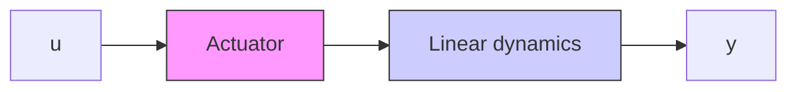

# Antiwindup for State-Space Controllers with an Explicit Observer

Consider first the case when the control law is described as an observer combined with a state feedback (9.1). The controller is a dynamic system, whose state is represented by the estimated state $\hat{x}$ in (9.1). In this case it is straightforward to see how the difficulties with the saturation may be avoided.

The estimator of (9.1) gives the correct estimate if the variable u in (9.1) is the actual control variable $u_{p}$ in Fig. 9.3. If the variable $u_{p}$ is measured, the estimate given by (9.1) and the state of the controller will be correct even if the control variable saturates. If the actuator output is not measured, it can be estimated—provided that the nonlinear characteristics are known. For the case of a simple saturation, the control law can be written as


<details>
<summary>flowchart</summary>


</details>

Figure 9.3 Block diagram of a process with a nonlinear actuator having saturation characteristics.


<details>
<summary>flowchart</summary>

```mermaid
graph LR
    y --> Observer
    Observer --> -x̂
    -x̂ --> Σ
    x_m --> Σ
    Σ --> State feedback
    State feedback --> L
    L --> Actuator
    Actuator --> u_p
```
</details>

Figure 9.4 Controller based on an observer and state feedback with anti-windup compensation.

$$
\begin{array}{l} \hat {x} (k | k) = \hat {x} (k | k - 1) + K \left(y (k) - C \hat {x} (k | k - 1)\right) \\ = (I - K C) \Phi \hat {x} (k - 1 | k - 1) + K y (k) + (I - K C) \Gamma \hat {u} _ {p} (k - 1) \tag {9.5} \\ \end{array}
\hat {u} _ {p} (k) = \operatorname{sat} \left(L \left(x _ {m} (k) - \hat {x} (k | k)\right) + D u _ {c} (k)\right)\hat {x} (k + 1 | k) = \Phi \hat {x} (k | k) + \Gamma \hat {u} _ {p} (k)
$$

where the function sat is defined as

$$
\mathrm{sat} u = \left\{ \begin{array}{l l} u _ {\text { low }} & u \leq u _ {\text { low }} \\ u & u _ {\text { low }} <   u <   u _ {\text { high }} \\ u _ {\text { high }} & u \geq u _ {\text { high }} \end{array} \right. \tag {9.6}
$$

for a scalar and
