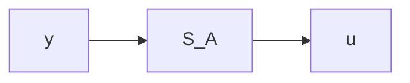
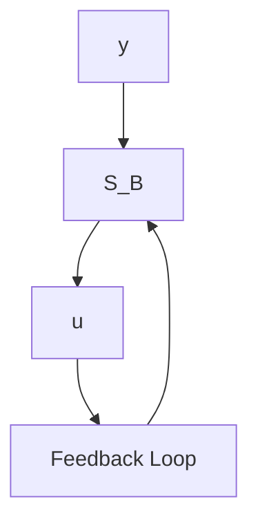

# Antiwindup for the General State-Space Model

The controller may also be specified as a state-space model of the form in (9.2):

$$x (k + 1) = F x (k) + G y (k) \tag {9.8}u (k) = C x (k) + D y (k) \tag {9.9}$$

flowchart

flowchart

Figure 9.5 Different representations of the control law.

which does not include an explicit observer. The command signals have been neglected for simplicity. If the matrix F has eigenvalues outside the unit disc and the control variable saturates, it is clear that windup may occur. Assume, for example, that the output is at its limit and there is a control error y. The state and the control signal will then continue to grow, although the influence on the process is restricted because of the saturation.

To avoid this difficulty, it is desirable to make sure that the state of (9.8) assumes a proper value when the control variable saturates. In conventional process controllers, this is accomplished by introducing a special tracking mode, which makes sure that the state of the controller corresponds to the input-output sequence $\{u_{p}(k), y(k)\}$ . The design of a tracking mode may be formulated as an observer problem. In the case of state feedback with an explicit observer, the tracking is done automatically by providing the observer with the actuator output $u_{p}$ or its estimate $\hat{u}_{p}$ . In the controller of (9.8) and (9.9), there is no explicit observer. To get a controller that avoids the windup problem, the solution for the controller with an explicit observer will be imitated. The control law is first rewritten as indicated in Fig. 9.5. The systems in (a) and (b) have the same input-output relation. The system $S_{B}$ is also stable. By introducing a saturation in the feedback loop in (b), the state of the system $S_{B}$ is always bounded if y and u are bounded. This argument may formally be expressed as follows. Multiply (9.9) by K and add to (9.8). This gives
