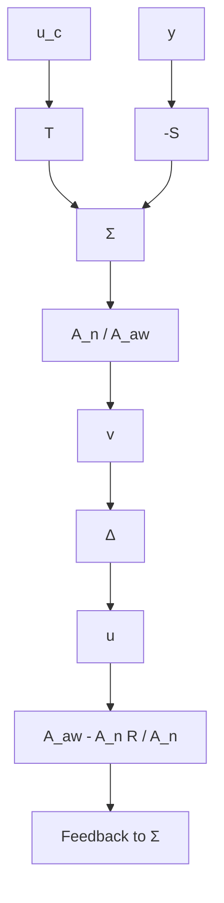

# 9.5 Operational Aspects

The interface between the controller and the operator is discussed in this section. This includes an evaluation of the information displayed to the operator and the mechanisms for the operator to change the parameters of the controller. In conventional analog controllers it is customary to display the set point, the measured output, and the control signal. The controller may also be switched from manual to automatic control. The operator may change the gain (or proportional band), the integration time, and the derivative time. This organization was motivated by properties of early analog hardware. When computers are used to implement the controllers, there are many other possibilities. So far the potentials of the computer have been used only to a very modest degree.

flowchart

Figure 9.9 A generalization of the antiwindup scheme in Fig.9.7.

To discuss the operator interface, it is necessary to consider how the system will be used operationally. This is mentioned in Sec. 6.2 and a few additional comments are given here. First, it is important to realize the wide variety of applications of control systems. There is no way to give a comprehensive treatment, so a few examples are given. For instance, the demands are very different for an autopilot, a process-control room, or a pilot plant.
