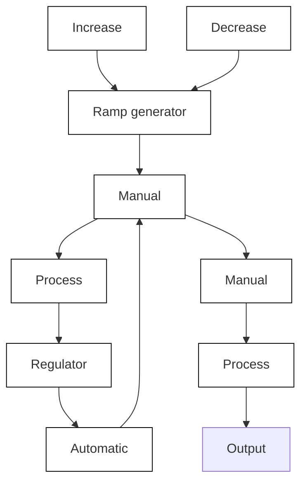

# Operating Modes

It is often desirable to have the possibility of running a system under manual control. A simple way to do this is to have the arrangement shown in Fig. 9.10, where the control variable may be adjusted manually. Manual control is often done with push buttons for increasing or decreasing the control variable.

Because the controller is a dynamic system, the state of the controller must have the correct value when the mode is switched from manual to automatic. If this is not the case, there will be a switching transient. A smooth transition is called bumpless transfer, or bumpless transition.

In conventional analog controllers, it is customary to handle bumpless transition by introducing a tracking mode, which adjusts the controller state so that it is compatible with the given inputs and outputs of the controller. A tracking mode may be viewed as an implementation of an observer.

flowchart

Figure 9.10 Control system with manual and automatic control modes.

A tracking mode is obtained automatically in the controllers of (9.5), (9.10), and (9.12) because they have an observer built into them. To run them in a tracking mode, simply put

$$u _ {\text { low }} = u _ {\text { high }} = u _ {\text { manual }}$$

This implies that the control signal is always equal to the manual input signal. The state of the controller will be reset automatically because of the internal feedback in the controller. The saturation introduced in the controller to handle actuator saturation will automatically give bumpless transfer. There are also other ways to have modes for semiautomatic control by keeping some feedback paths for stabilization.
