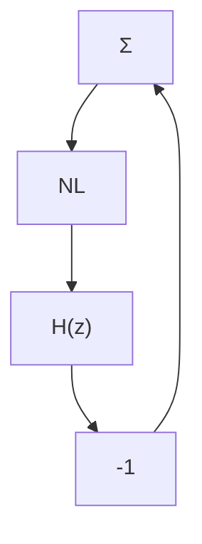

# Overview of Effects of Roundoff and Quantization

The consequences of roundoff and quantization depend on the feedback system and on the details of the algorithm. The properties may be influenced considerably by changing the representation of the control law or the details of the algorithm. Thus it is important to understand the phenomenon.

A detailed description of roundoff and quantization leads to a complicated nonlinear model, which is very difficult to analyze. Investigation of simple cases shows, however, that roundoff and quantization may lead to limit-cycle oscillations. Such examples are presented later, together with approximative analysis. Limit-cycle oscillations have also been observed in more complex cases.

Some properties of roundoff and quantization in a feedback system may also be captured by linear analysis. Roundoff and quantization are then modeled as ideal operations with additive or multiplicative disturbances. The disturbances may be either deterministic or stochastic. This type of analysis is particularly useful for order-of-magnitude estimation. It allows investigation of complex systems and it is useful when comparing different algorithms.

Techniques from sensitivity analysis and numerical analysis are also useful in finding the sensitivity of algorithms to changes of parameters. Such methods may be used to compare and screen different algorithms. However, the methods are limited to comparison of the open-loop performances of the algorithms. It is also necessary to compare the effects of roundoff and quantization with the other disturbances in the system.

(a)   

flowchart

(b)   

text_image

(b)
-1 / Y_c (A)
Im
Re
H(e^{i\omega h})

Figure 9.11 (a) Discrete-time system with one nonlinearity NL. (b) Using the method of describing function.
