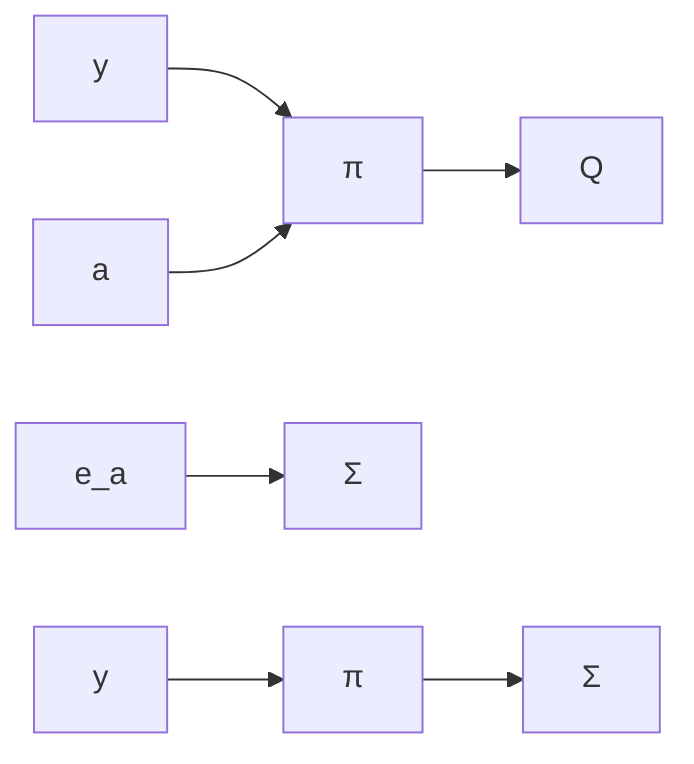

line

| x | Output |
| --- | --- |
| 0 | 0 |
| 5 | 0.2 |
| 10 | 0.8 |
| 15 | 1.2 |
| 20 | 1.1 |
| 25 | 1.0 |
| 30 | 1.0 |
| 35 | 1.0 |
| 40 | 1.0 |
| 45 | 1.0 |
| 50 | 1.0 |
| 55 | 1.0 |
| 60 | 1.0 |
| 65 | 1.0 |
| 70 | 1.0 |
| 75 | 1.0 |
| 80 | 1.0 |
| 85 | 1.0 |
| 90 | 1.0 |
| 95 | 1.0 |
| 100 | 1.0 |

scatter

| x | Output |
| --- | --- |
| 0 | 0 |
| 5 | 0.3 |
| 10 | 1.2 |
| 15 | 1.0 |
| 20 | 0.9 |
| 25 | 1.1 |
| 30 | 1.0 |
| 35 | 1.0 |
| 40 | 1.0 |
| 45 | 1.0 |
| 50 | 1.0 |
| 55 | 1.0 |

scatter

| Time | Output |
| --- | --- |
| 0 | 0.5 |
| 5 | 1.2 |
| 10 | 0.8 |
| 15 | 1.5 |
| 20 | 0.6 |
| 25 | 1.3 |
| 30 | 0.9 |
| 35 | 1.1 |
| 40 | 0.7 |
| 45 | 1.4 |
| 50 | 0.8 |
| 55 | 1.2 |
| 60 | 0.9 |
| 65 | 1.3 |
| 70 | 0.7 |
| 75 | 1.1 |
| 80 | 0.8 |

Figure 9.13 The output of the system in Example 9.4 when $\delta = 0.2$ and (a) $K = 0.8$ , (b) $K = 1.2$ , and (c) $K = 1.6$ .

flowchart

Figure 9.14 Linear models for multiplication with roundoff.

  
Figure 9.15 Control of a double integrator with a quantized A-D converter. The sampling period is 1 s and the quantization level is 0.02. The middle curve shows the quantized as well as the unquantized output.
