```mermaid
graph TD
    A["Σ"] --> B["α₀"]
    A --> C["1/β₁z"]
    A --> D["1/α₁"]
    E["Σ"] --> F["+"]
    G["1/βᵢz"] --> H["+"]
    I["1/αᵢ"] --> J["+"]
    K["Σ"] --> L["+"]
    M["1/βₙz"] --> N["+"]
    O["1/αₙ"] --> P["+"]
    Q["Σ"] --> R["+"]
    S["1/αᵢ₋₁"] --> T["+"]
    U["1/αᵢ"] --> V["+"]
    W["Σ"] --> X["+"]
    Y["1/αₙ₋₁"] --> Z["+"]
    AA["x₁"] --> AB["Σ"]
    AC["xᵢ"] --> AD["Σ"]
    AE["xᵢ₊₁"] --> AF["Σ"]
    AG["xₙ"] --> AH["Σ"]
    AI["y"] --> AJ["Σ"]
    AK["u"] --> AL["Σ"]
    AM["x₁"] --> AN["Σ"]
    AO["xᵢ"] --> AP["Σ"]
    AQ["xᵢ₊₁"] --> AR["Σ"]
    AS["xₙ"] --> AT["Σ"]
```

Figure 9.18 Block diagram of a ladder network representation of the transfer function (9.20).

A block diagram of the representation is shown in Fig. 9.18. The name ladder network derives from the shape of the graph.
