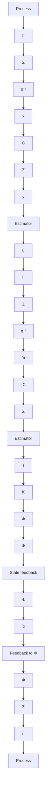

The controllers (11.58) and (11.60) can be written in a unified form as

$$u (k) = - \Big (L (k) + M (k) C \Big) \hat {x} (k \mid k - 1) - M (k) y (k) \tag {11.61}$$

where

$$
M (k) = \left\{ \begin{array}{l l} 0 & \text { if } u = f (Y _ {k - 1}) \\ L (k) K _ {f} (k) + L _ {v} (k) K _ {v} (k) & \text { if } u = f (y (k), Y _ {k - 1}) \end{array} \right.
$$

Substitution of (11.61) into (11.22) gives

$$J _ {\text { pred }} = J _ {\text { noise }} + \sum_ {k = 0} ^ {N - 1} \operatorname{tr} L (k) P (k) L ^ {T} (k) \left(\Gamma^ {T} S (k + 1) \Gamma + Q _ {2}\right)$$

where $J_{\mathrm{noise}}$ is given by (11.31). Further (11.61) gives in (11.23)

$$J _ {\text { filt }} = J _ {\text { pred }} - \sum_ {k = 0} ^ {N - 1} \operatorname{tr} M (k) \left(C P (k) C ^ {T} + R _ {2}\right) M ^ {T} (k) \left(\Gamma^ {T} S (k + 1) \Gamma + Q _ {2}\right)$$

flowchart

Figure 11.8 The closed-loop system when the controller in the separation theorem (Theorem 11.7) is used.

This shows that the loss is decreased when the current measurement is used to determine the control signal.

One consequence of the separation theorem is that the synthesis problem can be split into two parts, which can be solved separately. First, the deterministic control problem is solved, giving $L(k)$ (and $L_{v}(k)$ ). Second, the state is estimated using the Kalman filter. A block diagram of the system with the optimal-control law is shown in Fig. 11.8.
