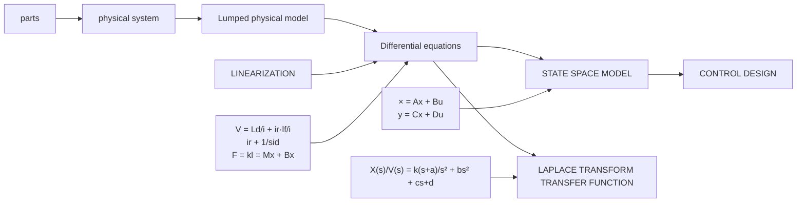

Figure 1.1: Conceptual ow of system analysis preceding control system design.s

Classical models are transfer functions based on use of the Laplace transform to convert LODEs into polynomials or ratios of polynomials. State Space models stay in the time domain and map a system of LODEs into a matrix version of a rst-order LODE.

The rest of this book will cover this process for the rst 4 Chapters. Then we will start designing controllers themselves in Chapters 5-11.
