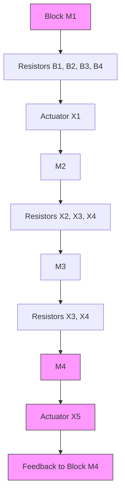

# CORRECT

Remember: dimensional agreement is a necessary but not sucient condition for correctness. If your solution fails dimensional analysis, you have denitely found an error but when it passes, there still could be

flowchart

Figure 2.5: A system with 4 masses and numerous springs and dampers connecting them.

another type of error.
