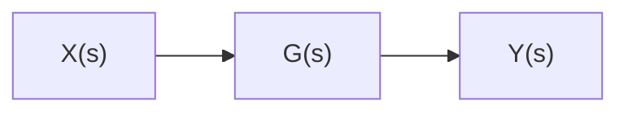

# 6.2.1 Signals vs. Energy Flows

A key distinction in understanding systems is that between signals and energy ows.

ˆ A signal is a variable which carries information but does not directly regulate the exchange of energy.   
For example, a voltage, V (t) which varies with time, carries some information. This voltage may be applied to a system component as an input but we will only call this a signal if the corresponding input current is zero (or negligible). In this case the input power is always zero.   
ˆ An energy ow is the case where a non-zero power ows into or out of the connection.

flowchart

Figure 6.1: A single block,
