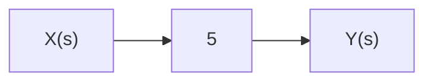
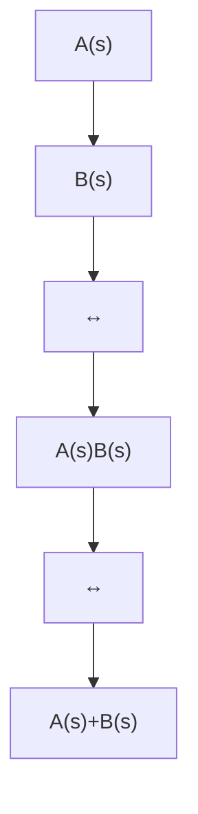

# Example 6.2

Find the expression for $Y ( s )$

flowchart

```mermaid
graph LR
    A["X(s)"] --> B["5"]
    B --> C["Y(s)"]
```

$$Y (s) = 5 X (s)$$

flowchart

```mermaid
graph TD
    A1["A(s)"] --> B1["B(s)"]
    B1 --> C1["↔"]
    C1 --> D1["A(s)B(s)"]
    D1 --> E1["↔"]
    E1 --> F1["A(s)+B(s)"]
```

Figure 6.2: Series and parallel connections of blocks.
