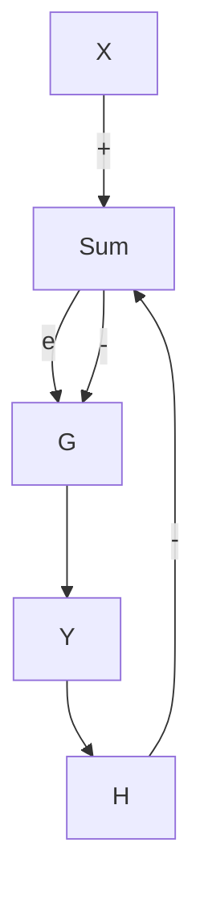

# 6.3 Closed Loop Negative Feedback Gain

One block diagram has supreme importance in control systems design (Figure 6.4). This is called the closed loop negative feedback system. As implied by its name, the connections of the diagram form a loop, the loop contains a minus sign, and the output is fed back to be subtracted from the input.

Even though this diagram is fairly simple, it is slightly more subtle to gure out an equivalent single block. In other words, can we gure out an expression for $\dot { Y } ( s ) / X ( s )$ from the block diagram of Figure 6.4? The key is identifying the output of the summation and giving it the name, E(s), which stand for error. This term is called error because it is the dierence between input and output. For example, if the closed loop negative feedback system were used to model a temperature control system, and the input was 68 degrees but the output (room temperature) was 72 degrees, then (with the frequently used assumption that H = 1) the error would be -4 degrees. Thus

  
Figure 6.3: Block diagram transformations.

flowchart

Figure 6.4: The closed loop negative feedback system.

$$E (s) = X (s) - Y (s) H (s)$$

Using block diagram relationships and dropping the (s) for convenience

$$Y = G E = G (X - Y H)Y = G X - G H YY (1 + G H) = G X\frac {Y}{X} = \frac {G}{(1 + G H)} \tag {6.2}$$

This expression is called the closed loop transfer function. It was discovered by H.S. Black of Bell Labs in 1927.

A common application of Figure 6.4 is a feedback control system in which G(s) represents a combination of a controller and a plant. The controller (typically implemented today with a microcontroller and associated I/O devices) generates a command signal to the plant which is the system to be controlled. The feedback element H is usually some kind of sensor which measures the output such as a temperature sensor or tachometer. In many control systems H = 1 since the objective is eliminating error betweeen the desired output (X) and the actual output (Y ).

An important case is when |GH| >> 1. Applying this to Equation 6.2,

$$\frac {Y}{X} \approx 1 / H$$
