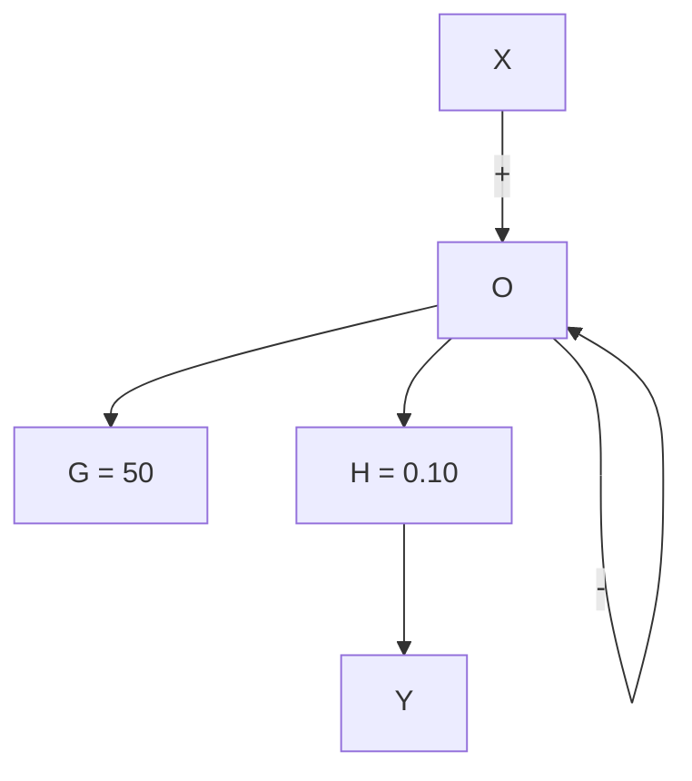

# Example 6.4

For the following system,

flowchart

Find YX

$$\frac {Y}{X} = \frac {G}{1 + G H} = \frac {5 0}{1 + 0 . 1 \times 5 0} = 8. 3 3$$

What if G = {100, 500, 105} ?

<table><tr><td>G</td><td>Y/X</td><td>GH</td></tr><tr><td>100</td><td> $\frac{100}{1+0.1\times 100} = 9.09$ </td><td>10 &gt; 1</td></tr><tr><td>500</td><td> $\frac{50}{51} = 9.80$ </td><td>50 &gt; 1</td></tr><tr><td> $10^5$ </td><td> $\frac{10^5}{1+10^4} = 9.9999$ </td><td> $10^4 >> 1$ </td></tr></table>

As GH gets larger in magnitude, Y /X gets closer and closer to 1/H. In this example, H < 1. While H = 1 is more typical for control systems, the situation where H < 1.0 is very often used in ampliers such as audio ampliers (HS Black's application).

As we will see in detail in the next sections, the behavior of closed loop negative feedback systems when GH >> 1 has major engineering advantages including:

ˆ Reduced sensitivity to parameter variations.   
ˆ Ability to reject external disturbances.
