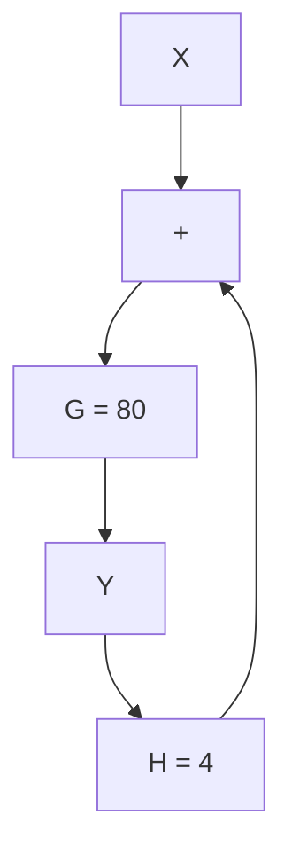

# 6.4 Sensitivity Analysis

The performance of a system depends on all of its parts, but which parameters are most important in determining performance? Sensitivity analysis is a way to answer that question. Often a low precision component costs much less than a high precision version of the same component. If the sensitivity of performance to a parameter is low, then use of a low precision component should have a small eect on performance and cost can be saved. Conversely, if sensitivity of performance to a dierent parameter is high, then a variation of its parameter value will make a big impact on performance which might justify the additional cost of a precision component.

We will call some measure of system performance, P . If a system has multiple performance measures, we use $P _ { i }$ to designate one of them. The parameters of a model of the system will be $p _ { i } .$ . With these denitions, we dene Sensitivity of performance measure i to parameter $j ,$ about the current values, $p _ { j 0 } , P _ { i 0 } ,$ as

$$S _ {i j} = \frac {\Delta P _ {i}}{\Delta p _ {j}} \frac {p _ {j 0}}{P _ {i 0}} \tag {6.3}$$

This is like a derivative, but it is normalized by the values of the parameter and performance measure. Qualitatively, sensitivity can be thought of as

$$S _ {i j} = \frac {\% \text {change in performance} _ {i}}{\% \text {change in parameter} _ {j}}$$

Although sensitivity can be derived analytically, we will concentrate here on using a numerical method.

Example 6.5   

flowchart

One aspect of performance is the gain or magnitude ratio, $\left| { \frac { Y } { X } } \right| .$ . Find the sensitivity of $\begin{array} { r } { P _ { i } = | \frac { Y } { X } | } \end{array}$ to the parameter G around the value $P _ { i 0 } \stackrel { \sim } { = } G = 8 0$ . In other words, compute sensitivity for

$$P _ {i} = \left| \frac {Y}{X} \right| \qquad p _ {j} = G$$

Choose $\Delta = 1 0 \%$ . We'll tabulate values of $G , H ,$ and $P _ { i }$ in order to compute $S _ { i j }$ . First, we compute $P _ { i }$ for two values of G which are separated by 10%.
