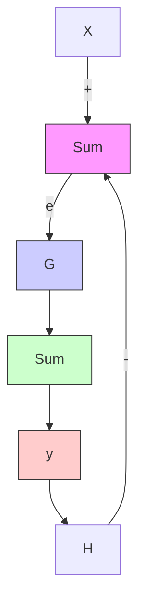

<table><tr><td>G</td><td>H</td><td></td><td>Pi</td></tr><tr><td>80</td><td>4</td><td colspan="2"> $\frac{80}{1+4\times80} = \frac{80}{321} = 0.24922$ </td></tr><tr><td>88</td><td>4</td><td colspan="2"> $\frac{88}{1+4\times88} = 0.24929$ </td></tr></table>

Now we compute $\Delta P _ { i }$ by subtracting the numerical results (note that we needed to use 6 signicant gures to get a non-zero result).

$$\Delta P _ {i} = 0. 2 4 9 2 9 - 0. 2 4 9 2 2 = 0. 0 0 0 0 7 = 7. 0 \times 1 0 ^ {- 5}$$

Then, using eqn. 6.3,

$$S _ {i j} = \frac {7 \times 1 0 ^ {- 5} / 0 . 2 4 9 2 2}{8 / 8 0} = 2. 8 1 \times 1 0 ^ {- 3} = 0. 3$$

Since sensitivity values are normalized by the nominal values of parameter and performance, we can judge them on an absolute scale where $S _ { i j } = 1 0 0 \%$ indicates strong sensitivity. In this case we can see that sensitivity of closed loop gain to G is small.

flowchart

Figure 6.6: A closed loop system with a disturbance.
