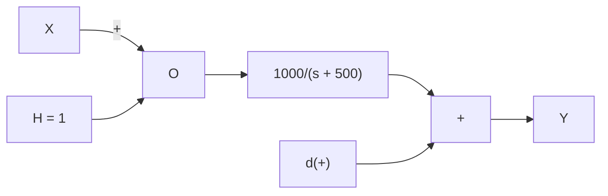

# 6.5.1 Disturbance Rejection in the Frequency Domain

Example 6.9   


<details>
<summary>flowchart</summary>


</details>

Find

$$\frac {Y (s)}{D (s)} \quad \text { for } \quad X (s) = 0$$

and sketch the BAMP of $G H ( j \omega )$ and $\frac { Y ( j \omega ) } { D ( j \omega ) }$ .

$$\frac {Y (s)}{D (s)} = \frac {1}{1 + G H} = \frac {s + 5 0 0}{s + 5 0 0 + 1 0 0 0} = \frac {(s + 5 0 0)}{(s + 1 5 0 0)}$$

and

$$G H (s) = \frac {1 0 0 0}{(s + 5 0 0)}$$


The disturbance rejection is -9.5dB for frequencies below about 100 rad/sec. There is little or no disturbance rejection above about 1000 (which is the point where loop gain magnitude is 1.0).


<details>
<summary>flowchart</summary>

```mermaid
graph TD
    X -->|+| Sum
    Sum -->|e| G
    G --> Y
    Y --> H
    H -->|-| Sum
    d(t) -->|d(t)| Sum
```
</details>

Figure 6.7: A closed loop negative feedback control system with a disturbance injected at the input.   


<details>
<summary>flowchart</summary>

```mermaid
graph LR
    X -->|+| e
    e --> G1
    G1 --> G2
    G2 --> Y
    y --> H
    H -->|-| e
    e --> G1
    G1 --> G2
    G2 -->|d(+)| e
    G2 -->|(Plant)| y
```
</details>

Figure 6.8: A closed loop negative feedback control system with a disturbance injected between the controller (G1) and the plant $G _ { 2 } )$ .
