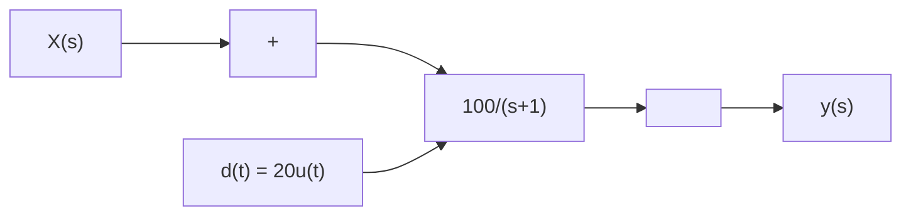
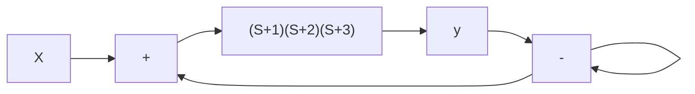

# Example 6.10

flowchart

As a nal example, for the system above, nd $Y ( s )$ and $y ( t ) = L ^ { - 1 } \left\{ Y ( s ) \right\}$ for x(t) = 0, X(s) = 0, d(t) = 20u(t).

$$Y (s) = \frac {G}{1 + G H} X (s) + \frac {1}{1 + G H} D (s)$$

Since X(s) = 0, and the Laplace transform of 20u(t) is $2 0 / s ,$

$$Y (s) = \frac {1}{1 + \frac {1 0 0}{(s + 1)}} D (s) = \frac {(s + 1)}{(s + 1 0 1)} 2 0 / s$$

Expanding this with partial fractions

$$\frac {2 0 (s + 1)}{s (s + 1 0 1)} = \frac {A _ {1}}{s} + \frac {A _ {2}}{(s + 1 0 1)}A _ {1} = \left. \frac {2 0 (s + 1)}{(s + 1 0 1)} \right| _ {s = 0} = \frac {2 0}{1 0 1} \approx 0. 2A _ {2} = \left. \frac {2 0 (s + 1)}{s} \right| _ {s - 1 0 1} = \frac {- 2 0 0 0}{- 1 0 1} \approx 2 0$$

Applying the inverse transform,

$$y (t) = 0. 2 u (t) + 2 0 e ^ {- 1 0 1 t}$$

line

| x | y |
| --- | --- |
| 0.0 | 20.0 |
| 0.1 | 1.0 |
| 0.2 | 0.5 |
| 0.3 | 0.3 |
| 0.4 | 0.2 |
| 0.5 | 0.1 |
| 0.6 | 0.1 |
| 0.7 | 0.1 |
| 0.8 | 0.1 |
| 0.9 | 0.1 |
| 1.0 | 0.1 |

The disturbance is reduced by about a factor of 100! (0.2u(t) compared to $2 0 u ( t ) )$ . Note however that the second term is a transient arising from the step input of the disturbance. Although this transient is over very quickly $\left( e ^ { - 1 0 1 t } \right)$ it has a signicant amplitude (20). Disturbance rejection cannot react instantly!

flowchart

Figure 6.9: A closed loop negative feedback system with stable poles in the feed-forward path. K is a positive real constant, a gain.
