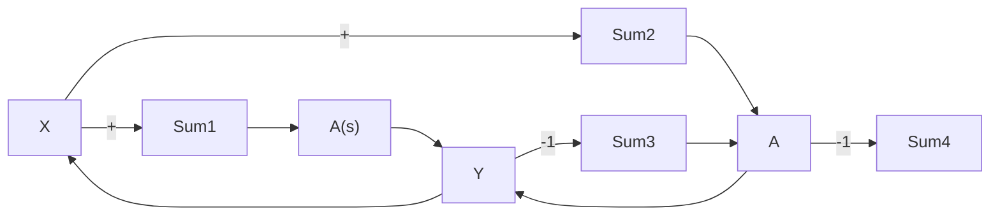

# 6.7 Stability in the Frequency Domain

The following is a very basic derivation of closed loop stability. It applies only to systems whos blocks have only poles with negative real parts or poles at the origin.

Consider the closed loop system of Figure 6.10 (Left). Recall that any function of s has a complex value which in turn has an angle and magnitude. Suppose we look at the steady state sinusoidal domain $( s = j \omega$ , see Section 5.4) and further suppose that for some ω,

$$\angle A (j \omega) = 1 8 0 ^ {\circ}$$

This would have the eect of changing the sign on the feedback loop and causing positive feedback also known as instability.

Suppose on the other hand that A is real $\left( { \mathrm { i . e . ~ } } \ \angle A = 0 \right)$ but we add a term of H = −1 (also $\angle H = 1 8 0 ^ { \circ } )$ to the feedback loop (Figure 6.10, Right). In both of these cases the total angle around the loop (the angle of the loop gain) is 180◦. Analyzing the closed loop gain

$$Y = A (X - (- Y)) = A X + A Y\frac {Y}{X} = \frac {A}{1 - A}$$

for the case $A = 1$ ,

$$| \frac {Y}{X} | \to \infty$$

flowchart

Figure 6.10: If the phase angle of $A ( s )$ is $1 8 0 ^ { \circ }$ , the gain around the loop becomes positive.

Lets expand $A ( s ) = C ( s ) P ( s )$ to represent the combination of controller $\left( C ( s ) \right)$ and plant $( P ( s ) )$ . Then, if the loop gain is $\begin{array} { r } { \dot { C } P H ( s ) = \dot { C } ( s ) P ( s ) H ( s ) } \end{array}$ , a condition on the loop gain for instability of the closed loop system is

$$\left| C P H (j \omega) \right| > = 1, \quad \angle C P H (j \omega) > = 1 8 0 ^ {\circ}$$

Using the BAMP we should be able to detect this combination.
