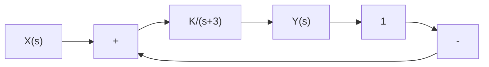
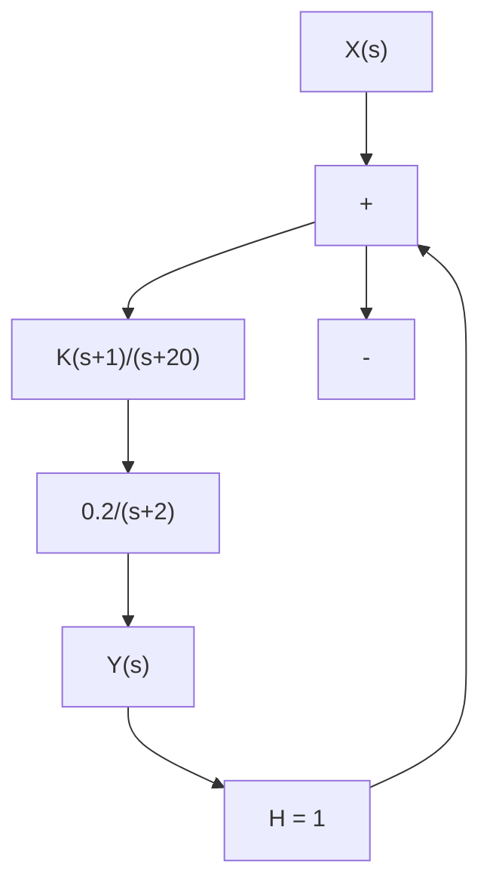

# 7.2.1 Problem Denition

What problem is Root Locus trying to solve? Consider the simple system of Figure 7.1. There is one unknown parameter K which we will assume is positive and real which represents a design parameter. Up until now, we have mostly focused on analysis of existing systems. Here we have the chance to design our system response (closed loop gain pole locations) by choosing our parameter K.

We know how to write two transfer functions from Figure 7.1. The loop gain (also called open loop gain) is the total gain around the loop:

$$G _ {L} (s) = C P H (s) = \frac {K}{(s + 3)}$$

flowchart

Figure 7.1: A very simple closed loop control system.

text_image

k=7
k=2
-10
-5
-3
Re(s)
Im(s)
3j
-3j

Figure 7.2: The closed loop pole of the simple system of Figure 7.1 as it moves according to dierent values of K .   

flowchart

Figure 7.3: A slightly more complex closed loop control system.

Loop gain controls key properties of a closed loop control system (for example we saw in Chapter 6 that the amount of disturbance rejection was controlled by the magnitude of the loop gain). However, the end user of our system only cares about the gain from X to Y which we call the closed loop gain,

$$G _ {C L} (s) = \frac {Y (s)}{X (s)} = \frac {K / (s + 3)}{1 + K / (s + 3)} = \frac {K}{(s + 3 + K)}$$

As engineers, we need to ddle with the loop gain, but the customer only cares that their cruise control is accurate, stable, and rejects disturbances etc.

While the loop gain has a known pole: s = −3, the pole of the closed loop gain depends on $K , s = - ( 3 { + } K )$ . For this very simple system therefore it is easy to nd the closed loop pole. Not only that, we know where the pole goes as K changes from $0  \infty ,$ it moves to the left along the real line (Figure 7.2).

But consider a slightly more complex (but still simple) system of Figure 7.3. Here, the loop gain is obtained by multiplying together the two blocks:

$$G _ {L} s = \frac {0 . 2 K (s + 1)}{(s + 2) (s + 2 0)}$$

and it is trivial to see its open loop poles, but the closed loop gain is

$$G _ {C L} (s) = \frac {0 . 2 K (s + 1)}{s ^ {2} + (2 2 + 0 . 2 K) s + 4 0 + 0 . 2 K}$$

Now as K changes, it is not at all obvious what are the poles or where they move. The Root Locus method was invented by Evans to gure this out (without manually solving the denominator polynomials for each value of K).
