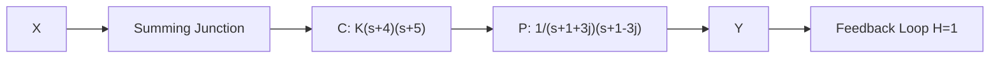

# Example 7.2

flowchart

Use the computer to plot a Root Locus diagram for the system above.

Here we have two blocks around the loop. C which represents a controller, and P which represents a plant. The closed loop system does not care how many blocks are in the loop, just the loop gain which is the product of all blocks around the loop.

$$G (s) = C P H (s) = C (s) P (s) = \frac {K (s + 4) (s + 5)}{(s + 1 + 3 j) (s + 1 - 3 j)}$$

Using python.control (Listing 7.2)

line

| x | y |
| --- | --- |
| -5 | 0 |
| -4 | 0 |
| -1 | 3 |
| -1 | -3 |

This time the closed loop poles migrate toward the two zeros in the controller. First they leave the loop gain poles (x's) and then join up at the real axis. After that they split again and migrate along the real axis until they hit the zeros.
