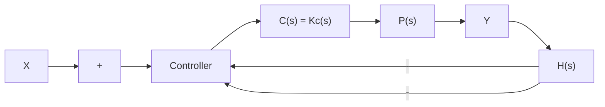

# 9.2.1 Steady State Error Derivation

The key to computation of steady state error is the Final Value Theorem of basic Laplace Transform theory:

$$\lim _ {t \rightarrow \infty} f (t) = \lim _ {s \rightarrow 0} s F (s) \tag {9.1}$$

flowchart

Figure 9.1: A basic closed loop control system.

Applying this to the system error E(s),

$$\lim _ {t \to \infty} e (t) = \lim _ {s \to 0} s E (s) \tag {9.2}$$

The quantity on the left is the steady state error, after all transient terms have died out. The Final Value Theorem says we can nd this nal SSE by evaluating the limit on the right. However, this theorem only applies if the limit on the left actually exists. For example, if $e ( t ) = B \sin ( \bar { \omega } t )$ , then the limit does not exist. Looked at in the complex plane, the poles of E(s) must be in the left half plane so that all transients die out.

Now let's apply the FVT to the expression for error.

$$E (s) = X (s) - C (s) P (s) H (s) E (s)$$

abbreviating $G ( s ) = C ( s ) P ( s )$ , and simplifying,

$$E (s) \left(1 + G H\right) = X (s)E (s) = \frac {X (s)}{1 + G H} \tag {9.3}$$

Let's apply this result to a specic system where:

$$C = 1 0 \quad P = \frac {5 0}{s + 1 0} \quad H = 1 \quad X (s) = \frac {A}{s}$$

Note that we have chosen a specic input (step function with amplitude A), for this analysis.

Using Equation 9.3,

$$E (s) = \frac {A / s}{(1 + 5 0 0 / (s + 1 0))} = \frac {A (s + 1 0)}{s (s + 1 0 + 5 0 0)} = \frac {A (s + 1 0)}{s ^ {2} + 5 1 0 s}$$

Applying the FVT:

$$\lim _ {t \to \infty} e (t) = \lim _ {s \to 0} s \frac {A (s + 1 0)}{s ^ {2} + 5 1 0 s} = \lim _ {s \to 0} \frac {A (s + 1 0)}{s + 5 1 0} = \frac {1 0 A}{5 1 0}\lim _ {t \to \infty} e (t) = 0. 0 2 A$$

In other words the Steady State Error (SSE) is 2%.
