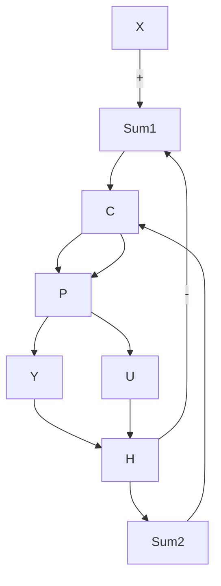

# 9.4 Control Eort

Control eort is the level of output needed by the controller to achieve the step response. All other things being equal, a controller which achieves the specs with lower control eort is better. Often there is a limited maximum eort that a given system can output. For example, a DC motor has a maximum torque that it is capable of (without overheating). In this case, it is meaningless to have a settling time that is very fast if that requires 10 times more torque that the motor's maximum limit. For some plants, controller gains can be found to meet any $T _ { S }$ and %OS spec if control eort limits are ignored.

Computing control eort is easy. Consider the system of Figure 9.6 which has a controller, plant and feedback.

The top system looks conventional, except we have brought out the control eort signal. In the second system we have simply rearranged the blocks without changing any connections. However we can now see this as a new feedback system having feedforward path C and feedback P H. Giving the traditional name U to the control output,

$$\frac {U (s)}{X (s)} = \frac {C (s)}{1 + C (s) P (s) H (s)}$$

If we have a limit on our actuator, for example,

$$\tau_ {m a x} = 1. 5 N m$$

then an appropriate measure of performance would be the maximum value of u(t): does it exceed 1.5Nm? . On the other hand, if we are concerned with total energy consumption, an appropriate measure might be

$$\int_ {0} ^ {T m a x} u ^ {2} (t) d t$$

flowchart

Figure 9.6: Control eort signal $u ( t )$ or $U ( s )$ comes from the output of the controller. We can easily get $U ( s )$ or u(t) by analyzing or simulating the bottom system.

where $T _ { m a x }$ denes a time window that makes sense for our application.
